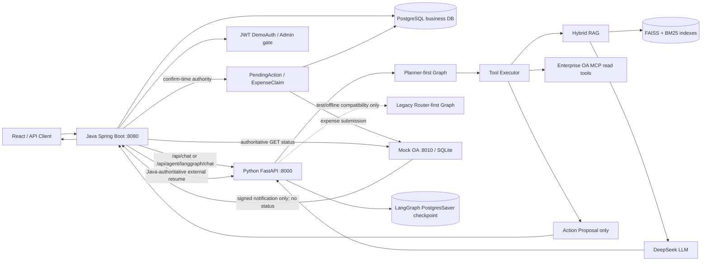

# Enterprise AI Copilot

[](https://github.com/izz-BLUE/enterprise-ai-copilot/actions/workflows/ci.yml)
[](https://github.com/izz-BLUE/enterprise-ai-copilot/actions/workflows/secret-scan.yml)
[](LICENSE)

Enterprise AI Copilot 是一个面向企业知识库问答和受控业务流程的工程化 RAG + Agent 平台。它把 Java 业务控制面与 Python AI 数据面分开：Java 负责认证、权限、持久化业务状态和最终授权；Python 负责 RAG、LLM 调用和 LangGraph 编排；React 提供操作界面。

项目的核心演示是“差旅报销”：Agent 可以读取企业 OA 的差旅和发票事实，生成确定性的报销 Proposal，经过用户确认、Java 业务写入和外部审批后，再以可恢复的 LangGraph Checkpoint 收口。年假申请是较短的第二条受控动作链路。

- 在线演示：<https://copilot.jintianchi.cn>
- Latest tagged release: [v0.4.1](https://github.com/izz-BLUE/enterprise-ai-copilot/releases/tag/v0.4.1)；current mainline includes newer Agent workflow capabilities documented here；本次 accuracy fix 不创建新的 tag/release。
- 项目定位：小规格单机部署与受控演示验证；不承诺生产 SLA。

## 项目定位

| 问题 | 项目解法 |
|---|---|
| 企业制度、HR、银行和 IT 文档难以检索 | FAISS 语义检索 + 字符级 BM25 + RRF 融合，回答附来源 |
| 普通 RAG 无法承载多步业务流程 | Planner-first LangGraph 负责有限规划，Tool Executor 负责程序化闸门 |
| AI 不应直接写业务数据 | Python 只生成 Proposal；Java PendingAction、nonce、权限、幂等和数据库事务是唯一写入口 |
| 外部审批会跨进程、跨服务、跨时间 | Java ExpenseClaim 持久化 correlation，Mock OA 权威状态 + webhook/reconciliation + external resume |
| 对话连续性容易与业务事实混淆 | Scoped Conversation Memory、execution_history、tool_history、Checkpoint 和 Java DB 分层 |

## Final architecture



Webhook 仅是通知；Java 直接 GET Mock OA 取得审批权威状态，再把 Java 已接受的终态作为 external resume 结果发送给 Python。

请求先进入 Java。Python 不对公网映射宿主机端口；在生产 Compose 中，Nginx 是公网入口，Java 绑定宿主机 `127.0.0.1:8080`，Python 只在 Docker 网络内 `expose 8000`。Java 生成并透传可信 `trace_id`、`employee_id`、`business_date`、conversation scope 和 runtime thread；这些字段不由 LLM arguments 提供。

### Planner-first Agent 图

生产入口固定使用 Planner-first：

```text
safety → planner ⇄ tool_executor → finalize
                              ├─ ordinary response → END
                              ├─ proposal → WAITING_USER → Java authority
                              └─ confirmed expense → WAITING_EXTERNAL → END
```

legacy Router-first 仅作为直接测试/离线兼容图保留：

```text
safety → router → rag | eval | action | refuse
```

Planner 只有规划权，没有业务执行授权。当前程序限制为最多 6 次 Planner decision、最多 5 次 Tool execution；可见 Tool 由可信 Runtime Context 和服务配置动态收缩，模型不能扩大集合。Tool Executor 还执行结构校验、员工身份、能力、预算和成功签名去重。

当前 Planner-first Tool 集合包括：

| Tool | 作用 | 可见条件 |
|---|---|---|
| `rag_answer_tool` | 检索并生成企业知识库答案 | 始终可见 |
| `leave_balance_tool` / `leave_request_tool` / `expense_status_tool` | 查询 Java 权威业务状态 | 员工身份、Java 内部地址和 token 均可用 |
| `travel_record_tool` / `invoice_verify_tool` | 通过 Enterprise OA MCP 读取当前差旅、发票事实 | 员工身份和 MCP 地址可用 |
| `eval_report_tool` | 读取评估报告 | `allow_eval=true` |
| `leave_proposal_tool` / `expense_proposal_tool` | 生成受控 Proposal，不执行写操作 | `allow_business_actions=true` 且有员工身份 |

Proposal Tools 不依赖 `JAVA_BASE_URL` / `JAVA_INTERNAL_TOKEN`；这两个变量只属于 Python → Java 的只读业务 Tool 链路。

## Durable workflows

### 受控业务动作与 Java authority

年假和报销共用 `BusinessActionService` 生命周期：

```text
Proposal
  → PENDING_CONFIRMATION
  → confirm: PROCESSING
  → SUCCEEDED | FAILED

cancel → CANCELLED
TTL     → EXPIRED
```

Proposal 阶段没有副作用。Java 创建 PendingAction 时重新校验 action type、字段、业务日期、权限、容量和业务规则，生成一次性 `confirmationNonce`（数据库只存摘要），并返回脱敏确认视图。Confirm 必须通过 owner、nonce、TTL、当前状态和 UUID `Idempotency-Key` 校验；重复确认重放原结果，不重复写业务表。Cancel/expire/失败也由 Java 结束对应 Memory 生命周期。

### Expense primary workflow

```text
用户问题
  → Planner
  → travel_record_tool + invoice_verify_tool + rag_answer_tool
  → expense_proposal_tool（确定性金额，不写库）
  → WAITING_USER / Java PendingAction
  → 用户 Confirm
  → Java confirm-time OA revalidation
  → ExpenseClaim + ExpenseItem 持久化，BusinessAction=SUCCEEDED
  → Python Command(resume) 收口用户确认
  → prepare_external_wait → WAITING_EXTERNAL
  → Java 向 Mock OA 提交 PENDING
  → Mock OA approve/reject
  → HMAC webhook 或 Java reconciliation
  → Java authoritative GET
  → ExpenseClaim APPROVED/REJECTED
  → Java external resume
  → Python Command(resume) → Graph END
```

`WAITING_USER` 是用户确认业务动作；`WAITING_EXTERNAL` 是 ExpenseClaim 已写入后等待外部审批。二者是两个不同的 interrupt、marker、resume endpoint 和 correlation，普通 Chat 不能跨过任一 active wait。

Confirm-time revalidation 在 Java 本地事务外调用 Python narrow adapter，读取当前 OA 事实并校验 trip 存在、归属、`APPROVED` 状态、当前日期可计算，发票归属/有效/非重复/金额/类别和精确清单；金额由 Java 再确定性计算。事实已变化时，Action=FAILED、Memory=ABANDONED、HITL=REJECTED，且不创建 ExpenseClaim，正常路径通过 REJECTED resume 到 Graph END；若 Java stale 终态已提交但 Python resume 暂时不可用，Java FAILED 不回滚，重复 Confirm 不重新查询 OA，只重试同一个确定性 REJECTED continuation。OA 不可用时保留 `PENDING_CONFIRMATION` 并返回 503，允许重试。远程读取和本地事务之间的小型 TOCTOU 窗口是已接受限制。

### Mock OA 与外部审批

Mock OA 是独立的 SQLite 模拟外部系统，不是企业业务事实源。提交使用 `Idempotency-Key: expense:<expenseId>`，初始为 `PENDING`；审批端点把它提交为 `APPROVED` 或 `REJECTED`。状态提交后才 best-effort 发送不含 status 的通知。Java 只接受精确 webhook 路径，验证原始 body 的 HMAC-SHA256 和不超过 5 分钟的 timestamp，再通过 Mock OA `GET` 取得权威状态；同终态 no-op，禁止回退到 `PENDING` 或反向覆盖终态。

Webhook 丢失时，reconciliation worker 始终低频、限批地扫描 `WAITING_APPROVAL + MOCK_OA + external_request_id`，按 `external_last_checked_at` 做 due CAS，短事务提交后在事务外 GET；provider 关闭或查询失败时 fail-closed。Java ExpenseClaim 终态提交后才发送 external resume；发送失败不会回滚 Java 终态，`external_resume_last_attempt_at` / `external_resume_completed_at` 支持低频重试。Python 收到严格 payload 后用 `Command(resume)` 收口 `Graph END`。

## Memory、history 与 checkpoint

项目中的四类状态不是同一个概念：

| 状态 | 生命周期 | 权威来源 | 用途 |
|---|---|---|---|
| Scoped Conversation Memory | `(user_id, conversation_id)`，只读 ACTIVE；Java 负责终态 | Java PostgreSQL `ai_task_memory` | 跨请求的当前任务连续性 |
| `tool_history` | 当前 execution/request | LangGraph `AgentState` | 当前调用去重和 Proposal 事实组装；新请求清空 |
| `execution_history` | 有界成功步骤摘要 | Graph Checkpoint | 仅在 ACTIVE Memory + task type 匹配时作为 `CONTEXT_ONLY` 上下文，不是事实/权限 |
| LangGraph Checkpoint | 同一 runtime thread 的执行现场 | `PostgresSaver` | crash recovery、HITL 和外部审批 interrupt 恢复 |
| Java business DB | 业务生命周期 | Java PostgreSQL | PendingAction、LeaveRequest、ExpenseClaim、ExpenseItem 的最终事实 |

Memory Read 只读取 ACTIVE；现有 ACTIVE Memory 本身不会触发新的 Extractor。Memory trigger 只来自 `action_proposal` 或白名单 Memory-eligible Tool 的成功结果；纯 RAG、eval、余额、历史查询、失败和拒答不触发。Python 仅执行 trigger → extractor → write policy，写策略只允许 `UPSERT + ACTIVE` 提案；Java 在当前认证上下文中持久化。Python 不执行 terminal Memory write，Memory 也不替代业务状态。

Python 固定使用 `ConnectionPool + PostgresSaver` 持久化执行快照；`LANGGRAPH_CHECKPOINT_DSN` 缺失或启动时 setup/连接/图编译失败即 fail-closed，不自动降级。崩溃恢复只接受精确 raw question、业务日期 anchor、actor scope、当前能力残留和 replay-safe pending node，通过后用 `graph.invoke(None)`；HITL 用户确认与外部审批分别使用 `Command(resume)`。

Java 和 Python 都有 process-local runtime-thread guard。Java guard 覆盖从 Memory Read 到 Python 调用、PendingAction/Memory 写入和响应结束的生命周期；Python guard 覆盖 recovery inspection 到最终 Checkpoint。单实例内按 exact-one owner release/handoff 规则工作，不是分布式锁。

## RAG pipeline

```text
data/hr|bank|it/*.md
  → paragraph/length chunking + overlap + metadata
  → BAAI/bge-small-zh-v1.5 embedding
  → FAISS semantic retrieval + character BM25
  → RRF fusion → optional Cross Encoder experiment
  → bounded context → DeepSeek prompt → answer + sources
```

`hybrid` 是默认检索模式；`vector` 和 `hybrid_rerank` 可用于比较。生产 RAG 固定不做 Query Rewrite，原始问题直接进入检索和最终 Prompt；`rule` 仅用于离线对照评估。无证据时明确拒答，不把检索结果当作业务授权。38 个固定用例覆盖来源/关键词命中和生成回归，并区分 answerable 与 no-answer。

## Quick start

### 本地三服务

```bash
# 1. Python AI service
cd agent-python
uv sync --group dev
uv run uvicorn app.main:app --reload --port 8000

# 2. Java business gateway
cd backend-java
./mvnw spring-boot:run

# 3. React UI
cd frontend
npm ci
npm run dev
```

前端地址为 `http://localhost:5173`，Java 为 `http://localhost:8080`，Python 为 `http://localhost:8000`。复制 `agent-python/.env.example` 为 `.env` 并提供模型配置；不要提交 `.env` 或任何 secret。Java 启动需要有效的 `AUTH_JWT_SECRET`（至少 32 bytes）以及本地数据库配置。

### 本地 PostgreSQL / Mock OA

```bash
docker compose -f deploy/docker-compose.local.yml up -d postgres mock-oa
```

本地 Python 启动即要求 `LANGGRAPH_CHECKPOINT_DSN` 并连接 PostgreSQL；按 [Demo Guide](docs/demo-guide.md) 配置 Java/Python/Mock OA。受控动作、Memory 写入和 Mock OA provider 仍默认关闭，按演示范围显式开启。

生产 Compose 默认启用 Planner-first 和 PostgreSQL Checkpoint，但仍要求运维显式提供数据库、JWT、Admin Token、模型密钥及实际的功能开关。详见 [Deployment](docs/deployment.md)。

## API quick reference

| 服务 | 路径 | 说明 |
|---|---|---|
| Java | `POST /api/chat` | 稳定 RAG 问答 |
| Java | `POST /api/agent/langgraph/chat` | Planner/Router Agent 入口 |
| Java | `POST /api/agent/actions/{actionId}/confirm` | 确认 PendingAction |
| Java | `POST /api/agent/actions/{actionId}/cancel` | 取消 PendingAction |
| Java | `POST /api/webhooks/mock-oa/expense-approval` | 精确 webhook 接收路径 |
| Python | `POST /agent/chat` | 稳定 RAG 内部入口 |
| Python | `POST /agent/langgraph/chat` | Agent 内部入口 |
| Python | `POST /agent/internal/expense/revalidate` | Java → Python confirm-time 窄适配器 |
| Python | `POST /agent/langgraph/hitl/resume` | Java-authoritative 用户确认恢复 |
| Python | `POST /agent/langgraph/external/resume` | Java-authoritative 外部审批恢复 |
| Mock OA | `POST/GET /api/expense-approvals...` | 模拟审批提交/查询 |

完整请求体、响应字段、错误码、内部 header 和 Mock OA 管理端点见 [API](docs/api.md)。

## Verification baseline

这是本项目当前接受的文档基线，不等价于生产容量承诺：

| 范围 | 结果 |
|---|---:|
| Java backend | 334 passed |
| Python full suite | 1402 passed + 34 expected skips |
| PostgreSQL checkpoint / crash resume / HITL / external resume | 34 passed, 0 skipped（17 + 7 + 5 + 5） |
| Enterprise OA MCP | 24 passed |
| Mock OA | 17 passed |
| Frontend | 44 passed |
| Lint/build | pass |

Repository automation 包含 CI（Java Backend、Mock OA Webhook、Python RAG Evaluation、Frontend Build、Frontend Browser Tests）、Gitleaks、CodeQL 和 Dependabot；Dependabot 是独立的依赖自动化，不是 CI job。质量边界与命令见 [Quality Assurance](docs/quality-assurance.md)。

## Design trade-offs and accepted limitations

| 选择 | 原因 | 接受的代价 |
|---|---|---|
| Java + Python 双服务 | Java 业务控制面与 Python AI 生态各自保持清晰边界 | HTTP DTO、超时和部署复杂度更高 |
| LangGraph 而非直接函数链 | 需要可检查的多步状态、HITL、Checkpoint 和恢复语义 | 需要严格 marker/correlation 和 replay policy |
| PostgreSQL Checkpoint 而非新工作流平台 | 当前规模已有 PostgreSQL，足以支撑验证目标 | 没有 Temporal/DBOS 级别的分布式编排能力 |
| Mock OA + webhook/reconciliation | 可在不接真实 OA 的情况下验证外部状态闭环 | 外部一致性、凭据和生产 SLA 尚未验证 |
| process-local guard | 单实例演示中实现简单、边界明确 | 多实例需要 distributed lease/lock；当前不实现 |
| RRF 而非直接相加检索分数 | FAISS 与 BM25 分数尺度不一致，排名融合更稳妥 | 小型领域数据集仍限制泛化能力 |

明确接受的边界：小规格单机、规则 Safety Guard、有限评估集、fixture-backed Enterprise OA MCP、Mock OA 模拟服务、没有真实 OA 分布式事务、没有生产凭据/正式集成验收、没有 SLA，也没有新增的分布式锁、消息总线或工作流引擎。

## Documentation map

- [Architecture](docs/architecture.md)：当前端到端架构、权威边界、恢复和接受限制
- [Controlled Business Actions](docs/controlled-business-actions.md)：年假/报销 Proposal、HITL、confirm-time revalidation、外部审批
- [API](docs/api.md)：公开、内部、Python 和 Mock OA 接口审计
- [Memory Architecture](docs/memory-architecture.md)：Memory、history、Checkpoint 分层
- [Memory Security](docs/memory-security.md)：身份、终态写入和数据边界
- [Memory Acceptance](docs/memory-p0-acceptance.md)：Memory 验收清单
- [Deployment](docs/deployment.md)：Compose、配置和网络边界
- [Demo Guide](docs/demo-guide.md)：报销主演示与年假次演示
- [Quality Assurance](docs/quality-assurance.md)：测试、CI、评估与限制
- [Roadmap](docs/roadmap.md)：已完成能力与真正未来项
- [Interview Materials](docs/interview/project-introduction.md)：项目介绍、架构走读、Demo 脚本、FAQ

## License

本项目用于工程实践、技术展示和面试交流，详见 [LICENSE](LICENSE)。
