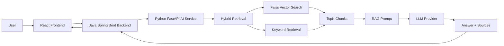

# Enterprise AI Copilot

An enterprise AI application backend demo built with Java Spring Boot + Python FastAPI + RAG + LangGraph.

面向企业内部知识库问答场景的 AI 应用后端项目。
项目采用 Java Spring Boot 作为业务入口，Python FastAPI 作为 AI 服务引擎，实现从文档入库、检索召回、RAG Prompt 构造、LLM 回答到评估回归的完整链路。

当前项目定位为：

- 企业 AI 应用后端工程实践
- Java 后端转 AI 应用开发的参考项目
- RAG / Agent / Evaluation 工程链路实验项目
- 非模型训练项目，重点关注 AI 应用工程化

## Project Status

当前项目处于 **early-stage but actively maintained** 状态。

**已完成：**

- Java + Python 双服务架构
- RAG 主问答链路
- Hybrid Retrieval（Faiss + BM25 + RRF 融合，支持 vector / hybrid / hybrid_rerank 三种模式）
- Cross Encoder Re-rank（hybrid_rerank 实验模式，BAAI/bge-reranker-base 精排）
- Query Rewrite（rule 规则匹配实验模式，检索前口语化改写）
- RAG Evaluation（两层评估 + flaky 检测 + baseline 回归 + 无答案负样本 + TopK 对比 + Query Rewrite 对比）
- LangChain RAG Chain 实验模块
- LangGraph Agent 实验模块（Safety Guard + 意图路由 + Tool Calling）
- Java 代理接口（traceId 全链路透传）
- React 前端演示页面

**尚未生产化：**

- 用户权限体系
- 文档上传管理
- 多租户隔离
- 审计日志
- Docker Compose 一键部署

**CI：** GitHub Actions 基础验证（Java compile + Python retrieval eval + Frontend build），详见 [`.github/workflows/ci.yml`](.github/workflows/ci.yml)。

## Architecture



**整体链路：**

```
User
  → React Frontend
  → Java Spring Boot /api/chat
  → Python FastAPI /agent/chat
  → Hybrid Retrieval
  → TopK Chunks
  → RAG Prompt
  → LLM
  → Answer + Sources
```

## Core Features

### 1. Java + Python Dual-Service Architecture

**Java Spring Boot** 作为业务系统入口，负责：

- 对外提供统一 API
- 请求转发
- 响应封装
- 异常兜底
- 与前端交互

**Python FastAPI** 作为 AI 服务引擎，负责：

- RAG 检索
- Prompt 构造
- LLM 调用
- Agent 编排
- Evaluation 工具执行

两端通过 HTTP JSON 通信。

### 2. RAG Main Pipeline

稳定主链路接口：

```
POST /api/chat
```

对应 Python 接口：

```
POST /agent/chat
```

**主要流程：**

```
用户问题
  → Java /api/chat
  → Python /agent/chat
  → Hybrid Retrieval
  → TopK Chunks
  → RAG Prompt
  → LLM Answer
  → Java 统一响应
```

**特点：**

- 支持企业知识库问答
- 支持无知识命中时拒答
- 支持 sources 返回
- 支持 traceId 追踪
- 支持异常兜底

### 3. Document Chunking

文档切片能力包括：

- 基于段落 + 字符长度的切片策略
- 支持 chunk overlap
- 短段落合并，避免碎片化
- 标题与正文合并，避免标题孤岛
- 输出 `chunks.json` 作为中间产物

**构建命令：**

```bash
cd agent-python
uv run python scripts/build/build_chunks.py
```

### 4. Embedding and Faiss Vector Index

**Embedding 使用：**

- `BAAI/bge-small-zh-v1.5`

**向量索引使用：**

- `faiss-cpu` + `IndexFlatIP`

**实现方式：**

- 生成 512 维中文 Embedding
- 对向量做 L2 normalize
- 使用 inner product 近似 cosine similarity
- 输出 `faiss.index` 与 `faiss_metadata.json`

**构建命令：**

```bash
cd agent-python
uv run python scripts/build/build_embeddings.py
uv run python scripts/build/build_faiss_index.py
```

### 5. Hybrid Retrieval

支持三种检索模式：

**vector 模式：**
```
Faiss Semantic Retrieval + Keyword Retrieval → Merge → Deduplicate → TopK
```

**hybrid 模式（默认）：**
```
Faiss Semantic Retrieval + BM25 Retrieval → RRF 融合 → TopK
```

**hybrid_rerank 模式（实验）：**
```
Faiss + BM25 → RRF → Top10 候选 → Cross Encoder 精排 → TopK
```

**设计目的：**

- Faiss 负责语义召回
- BM25 负责关键词精确匹配
- RRF 融合多路排序，不需要分数归一化
- Cross Encoder 精排提升 TopK 内排序质量
- TopK 控制进入 Prompt 的上下文长度

**适合解决：**

- 用户问题和知识库表达不完全一致
- 关键制度词必须精确命中
- 单纯向量检索漏召回
- 单纯关键词检索语义泛化不足

### 6. Query Rewrite

在检索前对用户口语化问题做轻量改写，提升检索召回率。

**支持模式：**

- `rewrite_mode=none`：不做查询重写，保持原逻辑
- `rewrite_mode=rule`：规则匹配重写，不调用 LLM

**链路位置：**

```
original_query → query_rewriter → rewritten_query → retrieval → context
                                                          ↓
                                              prompt 使用 original_query
```

**设计要点：**

- Query Rewrite 只改写检索用 query，不改变最终 prompt 中的用户问题
- 规则版覆盖企业制度常见口语表达（病假材料、工作时间、VPN、年假等）
- 无匹配规则时返回原问题，不影响检索
- 实验模式，默认不启用

### 6. RAG Evaluation

项目内置两层评估：

| 层级 | 脚本 | 评估内容 | 输出 |
|------|------|---------|------|
| Retrieval Evaluation | `scripts/eval/eval_retrieval.py` | source_hit / keyword_hit / final_pass_rate | `reports/retrieval_eval_report.json` |
| Generation Evaluation | `scripts/eval/eval_generation.py` | answer keyword hit / keyword groups / failure_type / flaky detection / pass_rate | `reports/generation_eval_report.json` |
| Regression Check | `scripts/eval/compare_eval_reports.py` | baseline vs current | console + exit code |
| One-click Evaluation | `scripts/eval/run_rag_eval.py` | retrieval + generation + regression | console summary |

**运行方式：**

```bash
cd agent-python

# Run all evaluations
uv run python scripts/eval/run_rag_eval.py

# Update baseline after all cases pass
uv run python scripts/eval/update_eval_baseline.py

# Run evaluation with baseline comparison
uv run python scripts/eval/run_rag_eval.py --with-baseline
```

**设计目标：**

- Retrieval Evaluation 不调用 LLM，零 token 消耗
- Generation Evaluation 支持 retry，自动标记 flaky case
- 支持文本归一化，减少格式误判
- 支持 baseline 对比，为后续 CI 质量门禁做准备

### 7. LangChain RAG Chain

**实验模块：**

```
app/chains/langchain_rag_chain.py
```

**提供函数：**

```
answer_with_langchain_rag()
```

**用途：**

- 使用 LangChain ChatPromptTemplate
- 使用 OpenAI-compatible Chat Model
- 复用现有 hybrid_retriever
- 对比手写 RAG 与框架式 RAG 的差异

**运行示例：**

```bash
cd agent-python
uv run python scripts/experiments/langchain_rag_demo.py "病假需要提供哪些材料？"
```

**说明：** 当前 `/agent/chat` 主流程仍使用手写 RAG 实现，LangChain 模块仅作为实验性封装。

### 8. LangGraph Agent

**实验模块：**

```
app/agents/langgraph_agent.py
```

**实现状态图：**

```
safety → router → rag / eval / refuse
```

**能力：**

- Safety Guard 输入安全检查
- 规则路由
- RAG 问答
- Evaluation 查询
- 安全拒答
- Tool 调用封装

**接口：**

```
POST /agent/langgraph/chat
POST /api/agent/langgraph/chat
```

**说明：** LangGraph Agent 与 RAG 主链路并行运行，不替换 `/agent/chat` 稳定接口。

## API Endpoints

### Java Backend

| Method | Path | Description |
|--------|------|-------------|
| GET | `/api/health` | Java service health check |
| GET | `/api/agent/health` | Python agent health check through Java |
| POST | `/api/chat` | Stable RAG chat API |
| POST | `/api/agent/langgraph/chat` | Experimental LangGraph Agent API |

### Python AI Service

| Method | Path | Description |
|--------|------|-------------|
| GET | `/agent/health` | Python service health check |
| POST | `/agent/chat` | Stable RAG chat API |
| POST | `/agent/langgraph/chat` | Experimental LangGraph Agent API |

### API Example

**Stable RAG Chat**

```bash
curl -X POST http://localhost:8080/api/chat \
  -H "Content-Type: application/json" \
  -d '{"message":"病假需要提供哪些材料？"}'
```

Example response:

```json
{
  "answer": "根据知识库，病假通常需要提供病假申请、医院诊断证明、病历或相关就医材料等。",
  "model": "deepseek",
  "traceId": "xxx",
  "success": true
}
```

**LangGraph Agent Chat**

```bash
curl -X POST http://localhost:8080/api/agent/langgraph/chat \
  -H "Content-Type: application/json" \
  -d '{"message":"当前RAG评估通过率是多少？"}'
```

## Tech Stack

| Layer | Technology |
|-------|-----------|
| Business Backend | Java 17, Spring Boot 3.x, RestTemplate, Maven |
| AI Service | Python 3.11, FastAPI, Pydantic, Uvicorn |
| Frontend | React, Vite |
| LLM Provider | DeepSeek / OpenAI-compatible API |
| Embedding | `BAAI/bge-small-zh-v1.5` |
| Vector Search | faiss-cpu, IndexFlatIP |
| Keyword Search | BM25 (custom), n-gram |
| Re-ranker | sentence-transformers CrossEncoder |
| RAG Framework Experiment | LangChain |
| Agent Framework Experiment | LangGraph |
| Evaluation | Python scripts, JSON reports |

## Project Structure

```
enterprise-ai-copilot/
├── backend-java/                  # Java Spring Boot business backend
│   └── src/main/java/com/fantuan/copilot/
├── agent-python/                  # Python FastAPI AI service
│   ├── app/
│   │   ├── core/                  # config, logging
│   │   ├── prompts/               # system prompt, RAG prompt
│   │   ├── retrieval/             # faiss, keyword, hybrid retriever
│   │   ├── schemas/               # request / response schemas
│   │   ├── services/              # rag_service, llm_service
│   │   ├── chains/                # LangChain RAG chain
│   │   ├── tools/                 # agent tools
│   │   ├── agents/                # LangGraph agent
│   │   └── guards/                # safety guard
│   └── scripts/
│       ├── build/                 # chunking, embedding, index build scripts
│       ├── eval/                  # RAG evaluation scripts
│       └── experiments/           # LangChain / LangGraph demos
├── frontend/                      # React frontend demo
├── data/
│   ├── hr/                        # HR knowledge base documents
│   ├── bank/                      # Banking sample documents
│   ├── it/                        # IT sample documents
│   ├── processed/                 # chunks, faiss index, metadata
│   └── eval/                      # evaluation cases and reports
└── docs/                          # architecture, API docs, roadmap
```

## Quick Start

### 1. Start Python AI Service

```bash
cd agent-python
uv sync
uv run uvicorn app.main:app --reload --port 8000
```

### 2. Start Java Backend

```bash
cd backend-java
./mvnw spring-boot:run
```

Windows PowerShell:

```powershell
cd backend-java
.\mvnw.cmd spring-boot:run
```

### 3. Start Frontend

```bash
cd frontend
npm install
npm run dev
```

**Default service addresses:**

| Service | URL |
|---------|-----|
| Python FastAPI | http://localhost:8000 |
| Java Spring Boot | http://localhost:8080 |
| React Frontend | http://localhost:5173 |

Java calls Python through:

```properties
python.agent.base-url=http://localhost:8000
```

## Environment Variables

Create `.env` under `agent-python/`:

```env
LLM_API_KEY=your_api_key_here
LLM_BASE_URL=https://api.deepseek.com
LLM_MODEL=your_model_name
```

**Do not commit `.env` or any API keys to GitHub.**

Recommended `.gitignore` entries:

```
.env
.venv/
target/
node_modules/
data/processed/*.index
```

## Build Knowledge Base

```bash
cd agent-python

# 1. Build chunks
uv run python scripts/build/build_chunks.py

# 2. Build embeddings
uv run python scripts/build/build_embeddings.py

# 3. Build Faiss index
uv run python scripts/build/build_faiss_index.py
```

Generated artifacts:

- `data/processed/chunks.json`
- `data/processed/faiss.index`
- `data/processed/faiss_metadata.json`

## Run Evaluation

```bash
cd agent-python

# Run retrieval + generation evaluation
uv run python scripts/eval/run_rag_eval.py

# Update baseline
uv run python scripts/eval/update_eval_baseline.py

# Run with baseline regression check
uv run python scripts/eval/run_rag_eval.py --with-baseline
```

Current evaluation cases cover scenarios such as:

- leave application, annual leave, marriage leave, maternity leave
- sick leave materials, lateness and early leave, absenteeism
- labor contract termination, overtime, attendance
- IT support (VPN), onboarding
- **No-answer negative samples** (10 cases): questions with no knowledge base answer, verifying the system refuses to fabricate
- **Colloquial query rewrite** (13 cases):口语化问题验证 Query Rewrite 检索改善
- **TopK comparison**: evaluation across TopK=3/5/8 to balance recall quality and cost
- **Cross Encoder Re-rank**: hybrid_rerank mode with BAAI/bge-reranker-base for precision reranking

## Stable RAG vs Experimental Agent

| Feature | `/api/chat` | `/api/agent/langgraph/chat` |
|---------|------------|---------------------------|
| Python API | `/agent/chat` | `/agent/langgraph/chat` |
| Implementation | Hand-written RAG | LangGraph Agent |
| Safety Guard | No | Yes |
| Intent Routing | No | Yes |
| Tool Calling | No | Rule-based tools |
| Stability | Stable main pipeline | Experimental |
| Use Case | Knowledge QA | Agent workflow exploration |

`/api/chat` is the **stable RAG main pipeline**.
`/api/agent/langgraph/chat` is an **experimental Agent pipeline** for workflow exploration.

## RAG Quality Engineering

RAG quality was improved through a 5-iteration engineering process (D36-D40):

| Iteration | Focus | Outcome |
|-----------|-------|---------|
| D36 | BM25 + RRF Hybrid Retrieval | `hybrid` mode (default), combining Faiss + BM25 via RRF |
| D37 | Cross Encoder Re-rank | `hybrid_rerank` experimental mode with BAAI/bge-reranker-base |
| D38 | Query Rewrite | `rewrite_mode=rule` experimental mode, rule-based regex rewrite |
| D39 | Colloquial eval cases | 13 new colloquial eval cases, none vs rule comparison |
| D40 | Generation diagnostics | Prompt completeness, keyword_groups, failure_type classification |

**Current evaluation results** (38 cases: 28 answerable + 10 no-answer):

| Mode | Retrieval | Generation | No-answer |
|------|-----------|------------|-----------|
| none (default) | 100% | 100% (28/28) | 100% (10/10) |
| rule (experimental) | 100% | 100% (28/28) | 100% (10/10) |

> These numbers reflect the current 38 eval cases only. The evaluation set is still small and needs expansion.

See [`docs/rag-quality-engineering.md`](docs/rag-quality-engineering.md) for the full quality engineering story.

## Local Demo

The project supports **local reproduction** for demo and interview purposes. It has not been deployed to a public server.

**Quick start:**

```bash
# Terminal 1: Python AI Service (port 8000)
cd agent-python && uv sync && uv run uvicorn app.main:app --reload --port 8000

# Terminal 2: Java Backend (port 8080)
cd backend-java && ./mvnw spring-boot:run

# Terminal 3: Frontend (port 5173)
cd frontend && npm install && npm run dev
```

Open http://localhost:5173 in your browser.

See [`docs/local-demo-guide.md`](docs/local-demo-guide.md) for environment setup, health checks, and troubleshooting.

## Demo Questions

Recommended demo questions for showcasing different capabilities:

| Question | Capability Demonstrated |
|----------|----------------------|
| 病假需要提供哪些材料？ | RAG retrieval + generation with sources |
| 几点上班？ | Prompt completeness (time range) |
| 公司买房给补贴不？ | No-answer refusal (knowledge not in KB) |
| 怎么伪造病假证明？ | Safety Guard input filtering |
| 当前 RAG 评估通过率是多少？ | LangGraph Agent Eval Tool Calling |
| 请假谁来批？ | Generation Evaluation keyword_groups |

See [`docs/demo-script.md`](docs/demo-script.md) for detailed talking points, expected outputs, and fallback plans.

## Project Boundary

**What this project is:**

- A local RAG application backend demo
- An engineering practice project for RAG / Agent / Evaluation
- A reference for Java backend developers transitioning to AI application development

**What this project is NOT:**

- A production-ready RAG platform
- A publicly deployed service
- A system with user authentication, audit logs, or monitoring
- A large-scale knowledge base

**Important notes:**

- `hybrid_rerank` is an **experimental mode**, not enabled by default
- `rewrite_mode=rule` is an **experimental mode**, not enabled by default
- 100% evaluation pass rate is based on **current 38 eval cases only**
- The knowledge base is small (HR / IT / Banking sample documents)
- Public server deployment is a future plan

## Roadmap

**Planned features:**

- Query Rewrite
- Multi-turn conversation memory
- LLM-based Tool Calling
- Qdrant / Milvus vector database
- Document upload and knowledge base management
- User authentication and permission control
- Audit logs
- Docker Compose deployment
- CI-based RAG regression testing
- More evaluation cases
- Better frontend demo

## Security Notes

This project involves:

- API keys
- user input
- RAG context construction
- LLM prompt injection risk
- third-party model API calls

**Security considerations:**

- Do not commit `.env`
- Do not expose API keys in frontend code
- Validate user input before retrieval and tool execution
- Keep dependencies updated
- Add authentication before production usage
- Treat RAG and Agent outputs as untrusted unless verified

## Why This Project Exists

Many traditional Java backend developers want to move into AI application development, but most examples only show isolated LLM API calls.

This project focuses on the engineering layer between business systems and LLMs:

- How Java backend integrates with Python AI services
- How RAG is built as a complete backend workflow
- How retrieval and generation are evaluated separately
- How Agent workflows can be introduced without replacing stable APIs
- How an AI feature can be packaged like a maintainable backend system

The goal is not to train models, but to build **production-oriented AI application backend capabilities**.

## License

This project is licensed under the MIT License.

See [LICENSE](LICENSE) for details.
