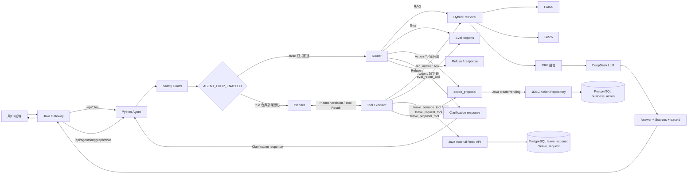

# Enterprise AI Copilot

[](https://github.com/izz-BLUE/enterprise-ai-copilot/actions/workflows/ci.yml)
[](https://github.com/izz-BLUE/enterprise-ai-copilot/actions/workflows/secret-scan.yml)
[](https://github.com/izz-BLUE/enterprise-ai-copilot/releases/latest)
[](LICENSE)

面向企业知识库问答和受控业务流程的工程化 RAG + Agent 平台。Java Spring Boot 负责 API、权限边界和流量控制，Python FastAPI 负责检索、生成与 Agent 编排，React 提供演示界面。仓库部署默认走 Planner-first 状态图；legacy Router-first 是已实装的另一套互斥状态图，需通过 `AGENT_LOOP_ENABLED=false` 显式回退。Python Planner 拥有规划权但没有最终业务执行授权；受控业务动作仍保留 Java 权威校验和用户确认边界。

- 在线演示：<https://copilot.jintianchi.cn>
- 当前版本：[v0.4.0](docs/releases/v0.4.0.md)
- 项目边界：已完成小规格单机部署和短时受控验证，不承诺生产 SLA

## Architecture



稳定 RAG 走 `Java → Python /agent/chat → Hybrid Retrieval`；LangGraph 走 `Safety Guard` 后按 `AGENT_LOOP_ENABLED` 进入两套互斥图之一（legacy Router-first 或 Planner-first）。公网请求经过 Nginx 和 Java，Python 不映射宿主机端口。

企业请假只读 Tool（`leave_balance_tool` / `leave_request_tool`）的链路是：Java 侧完成身份解析后，将可信 `employee_id` 注入 Python AgentState；Python Tool Executor 再通过最小 HTTP client 调用 Java `/api/internal/leave/*`，Java 使用 `JAVA_INTERNAL_TOKEN` 鉴权并严格按员工身份查询 PostgreSQL。`employee_id` 和 `trace_id` 不属于 LLM 可控 arguments。`leave_proposal_tool` 只生成 `action_proposal` / `missing_fields`（Clarification），**不执行写操作**，且不依赖 `JAVA_BASE_URL` / `JAVA_INTERNAL_TOKEN`；`confirmationNonce`、PendingAction 持久化、状态机、TTL、幂等、权限与最终数据库写入全部由 Java 完成。

Scoped Conversation Memory P0 已接入 Planner-first Agent：Java 以可信 `(user_id, conversation_id)` 读取 ACTIVE memory，通过内部 `memoryContext` 注入 Python；Agent 出口的 Memory Extractor 只返回结构化 `UPSERT + ACTIVE` 提案。写入模式由 `MEMORY_WRITE_MODE` 控制：`DISABLED`（默认）/ `AUDIT_ONLY` / `ENABLED`。Java 在同一个已认证请求中决定 owner 与 conversation scope；动作提案必须先成功创建 PendingAction，之后才写入 Memory。

## What this project demonstrates

| Area | Implementation and evidence |
|------|-----------------------------|
| Retrieval | FAISS 语义检索 + 字符级 BM25 + RRF；38 个固定用例回归 |
| Query handling | 生产演示启用确定性规则改写，保留原问题用于最终 Prompt |
| Runtime | Torch-free ONNX Runtime；Embedding 进程内存由 877 MiB 降至 174 MiB |
| Safety | 两条问答链路均执行规则版 Safety Guard；Evaluation 使用 Admin Token |
| Isolation | Nginx → localhost Java → Docker 内网 Python；模型和数据只读挂载 |
| Overload control | Nginx 限流 + Java/Python 各 3 个并发槽；超限返回 JSON 429 |
| Verification | Java/Python 单测、检索评估、前端 lint/build、Playwright、分层 k6 场景 |
| Controlled actions | 三个白名单 Demo 身份、PostgreSQL 数据隔离、HITL 确认与 `LeaveExecutionGateway` |
| Enterprise read tools | `leave_balance_tool` / `leave_request_tool`、Planner 参数白名单、Java 内部接口鉴权与员工身份隔离 |
| Scoped conversation memory | ACTIVE read path、结构化 Extractor/WritePolicy、Java 当前认证上下文写入、DISABLED/AUDIT_ONLY/ENABLED |
| AI observability | 可选 Phoenix/OpenTelemetry Trace；批量异步导出、采样、默认正文脱敏、Collector 故障不阻断业务 |

## Design decisions and trade-offs

| Decision | Why | Current limitation |
|----------|-----|--------------------|
| Java 控制面 + Python AI 服务 | 保留 Java 的 API/权限能力，同时使用 Python AI 生态 | DTO 需要跨服务同步，部署比单体复杂 |
| RRF 融合 FAISS 与 BM25 | 两种检索分数尺度不同，按排名融合无需手工归一化 | 融合参数仍基于小型领域数据集 |
| 规则 Query Rewrite | 延迟和成本可预测，可确定性回归 | 只能覆盖已知口语表达 |
| 双层并发槽而非长队列 | 小规格机器过载时快速失败，避免线程和内存持续堆积 | 单机吞吐上限较低，尚未验证水平扩容 |
| LangGraph 两套互斥状态图 | 便于比较 legacy Router-first 与 Planner-first，不影响稳定接口 | 具有有限自主规划能力，但受 Tool 白名单、权限校验、`MAX_PLANNER_STEPS=5`、`MAX_TOOL_CALLS=3` 和 Java 最终授权边界约束 |

Cross Encoder 精排和 Retrieval Shadow Gate 均做过实验，但在当前数据集上没有形成足够收益，因此未作为生产演示默认路径。

## Documentation

| 文档 | 说明 |
|------|------|
| [Architecture](docs/architecture.md) | 架构设计、模块职责、网络拓扑 |
| [Deployment](docs/deployment.md) | 部署方案、目录结构、Compose 配置 |
| [Performance](docs/performance.md) | ONNX 优化、内存对比、向量一致性 |
| [Concurrency & Load Test](docs/concurrency-and-load-test.md) | 有界并发设计、超时预算、k6 分层压测 |
| [Quality Assurance](docs/quality-assurance.md) | CI、检索评估、安全检查、发布验证与已知边界 |
| [Memory Architecture](docs/memory-architecture.md) | Scoped Conversation Memory P0 运行时链路、Read / Write Path、模块依赖边界 |
| [Memory Security](docs/memory-security.md) | Memory P0 安全边界勾选项与运行时错误分类（Python / Java） |
| [Memory P0 Acceptance](docs/memory-p0-acceptance.md) | Memory P0 最终审计、Pre-commit Gates、归档组件与最近一次验收结果 |
| [v0.4.0 Release Notes](docs/releases/v0.4.0.md) | 有界并发、目标服务器验收摘要、升级与回滚说明 |
| [API](docs/api.md) | 接口文档、请求响应格式 |
| [Demo Guide](docs/demo-guide.md) | 多用户请假演示、越权拒绝、幂等与持久化恢复操作手册 |
| [Roadmap](docs/roadmap.md) | 已完成 / 计划中 / 未来功能 |
| [Contributing](CONTRIBUTING.md) | 本地检查、变更规范与 PR 清单 |

## Interview Materials

面试讲解材料，包含项目介绍、Demo 脚本、架构讲解和常见追问 Q&A：

| 文档 | 说明 |
|------|------|
| [Project Introduction](docs/interview/project-introduction.md) | 30 秒 / 1 分钟 / 3 分钟项目介绍版本 |
| [Demo Script](docs/interview/demo-script.md) | 10 分钟面试 Demo 路线（含操作、预期、话术） |
| [Architecture Walkthrough](docs/interview/architecture-walkthrough.md) | 5 分钟架构讲解稿 |
| [FAQ & Deep Dive](docs/interview/faq-and-deep-dive.md) | 20 个面试官追问 Q&A |

## Core Features

### 1. Java + Python Dual-Service Architecture

**Java Spring Boot** 作为业务系统入口，负责：

- 对外提供统一 API
- 请求转发
- 响应封装
- 异常兜底
- 与前端交互

**Python FastAPI** 作为 AI 服务引擎，负责：

- RAG 检索
- Prompt 构造
- LLM 调用
- Agent 编排
- Evaluation 工具执行

两端通过 HTTP JSON 通信。

### 2. RAG Main Pipeline

稳定主链路接口：

```
POST /api/chat
```

对应 Python 接口：

```
POST /agent/chat
```

**主要流程：**

```
用户问题
  → Java /api/chat
  → Python /agent/chat
  → Hybrid Retrieval
  → TopK Chunks
  → RAG Prompt
  → LLM Answer
  → Java 统一响应
```

**特点：**

- 支持企业知识库问答
- 支持无知识命中时拒答
- 支持 sources 返回
- 支持 traceId 追踪
- 支持异常兜底

### 3. Document Chunking

文档切片能力包括：

- 基于段落 + 字符长度的切片策略
- 支持 chunk overlap
- 短段落合并，避免碎片化
- 标题与正文合并，避免标题孤岛
- 输出 `chunks.json` 作为中间产物

**构建命令：**

```bash
cd agent-python
uv run python scripts/build/build_chunks.py
```

### 4. Embedding and Faiss Vector Index

**Embedding 使用：**

- `BAAI/bge-small-zh-v1.5`

**向量索引使用：**

- `faiss-cpu` + `IndexFlatIP`

**实现方式：**

- 生成 512 维中文 Embedding
- 对向量做 L2 normalize
- 使用 inner product 近似 cosine similarity
- 输出 `faiss.index` 与 `faiss_metadata.json`

**构建命令：**

```bash
cd agent-python
uv run python scripts/build/build_embeddings.py
uv run python scripts/build/build_faiss_index.py
```

### 5. Hybrid Retrieval

支持三种检索模式：

**vector 模式：**
```
Faiss Semantic Retrieval + Keyword Retrieval → Merge → Deduplicate → TopK
```

**hybrid 模式（默认）：**
```
Faiss Semantic Retrieval + BM25 Retrieval → RRF 融合 → TopK
```

**hybrid_rerank 模式（实验）：**
```
Faiss + BM25 → RRF → Top10 候选 → Cross Encoder 精排 → TopK
```

**设计目的：**

- Faiss 负责语义召回
- BM25 负责关键词精确匹配
- RRF 融合多路排序，不需要分数归一化
- Cross Encoder 精排提升 TopK 内排序质量
- TopK 控制进入 Prompt 的上下文长度

**适合解决：**

- 用户问题和知识库表达不完全一致
- 关键制度词必须精确命中
- 单纯向量检索漏召回
- 单纯关键词检索语义泛化不足

### 6. Query Rewrite

在检索前对用户口语化问题做轻量改写，提升检索召回率。

**支持模式：**

- `rewrite_mode=none`：不做查询重写，保持原逻辑
- `rewrite_mode=rule`：规则匹配重写，不调用 LLM

**链路位置：**

```
original_query → query_rewriter → rewritten_query → retrieval → context
                                                          ↓
                                              prompt 使用 original_query
```

**设计要点：**

- Query Rewrite 只改写检索用 query，不改变最终 prompt 中的用户问题
- 规则版覆盖企业制度常见口语表达（病假材料、工作时间、VPN、年假等）
- 无匹配规则时返回原问题，不影响检索
- 实验模式，默认不启用

### 7. RAG Evaluation

项目内置两层评估：

| 层级 | 脚本 | 评估内容 | 输出 |
|------|------|---------|------|
| Retrieval Evaluation | `scripts/eval/eval_retrieval.py` | source_hit / keyword_hit / final_pass_rate | `reports/retrieval_eval_report.json` |
| Generation Evaluation | `scripts/eval/eval_generation.py` | answer keyword hit / keyword groups / failure_type / flaky detection / pass_rate | `reports/generation_eval_report.json` |
| Regression Check | `scripts/eval/compare_eval_reports.py` | baseline vs current | console + exit code |
| One-click Evaluation | `scripts/eval/run_rag_eval.py` | retrieval + generation + regression | console summary |

**运行方式：**

```bash
cd agent-python

# Run all evaluations
uv run python scripts/eval/run_rag_eval.py

# Update baseline after all cases pass
uv run python scripts/eval/update_eval_baseline.py

# Run evaluation with baseline comparison
uv run python scripts/eval/run_rag_eval.py --with-baseline
```

**设计目标：**

- Retrieval Evaluation 不调用 LLM，零 token 消耗
- Generation Evaluation 支持 retry，自动标记 flaky case
- 支持文本归一化，减少格式误判
- 支持 baseline 对比，为后续 CI 质量门禁做准备

### 8. 统一 RAG 入口

**生产实现：** `app/services/rag_answer_service.py`

标准问答与 Agent 的 `rag_answer_tool` 共用同一套查询重写、检索、Gate、Prompt、LLM 和来源映射，避免两条实现漂移。

**兼容模块：**

```
app/chains/langchain_rag_chain.py
```

**提供函数：**

```
answer_with_langchain_rag()
```

该函数只委托统一 RAG Service，保留旧实验脚本入口，不再创建第二套 Prompt、模型客户端或重试策略。

**运行示例：**

```bash
cd agent-python
uv run python scripts/experiments/langchain_rag_demo.py "病假需要提供哪些材料？"
```

**说明：** `langchain-openai` 已从生产依赖移除。

### 9. LangGraph Agent

**模块：**

```
app/agents/langgraph_agent.py
```

**两套互斥状态图（由 `AGENT_LOOP_ENABLED` 切换）：**

- **legacy Router-first**（`AGENT_LOOP_ENABLED=false`，显式回退）

```text
safety → router → rag | eval | action | refuse
```

- **Planner-first**（`AGENT_LOOP_ENABLED=true`，仓库部署默认）

```text
safety → planner ⇄ tool_executor
```

Planner-first 最多支持 5 个 Tool，实际可见集合由程序层按权限动态收缩，**模型不能自行扩大 Tool 权限**：

- 默认可见：`rag_answer_tool` / `leave_balance_tool` / `leave_request_tool`
- `allow_eval=true` 时追加：`eval_report_tool`
- `allow_business_actions=true` 时追加：`leave_proposal_tool`

Planner 拥有规划权但没有最终业务执行授权；Tool Executor 独立做权限 / Tool 预算 / 成功签名去重校验；可信系统字段（`employee_id` / `business_date` / `trace_id`）由程序层注入，不进入 LLM `arguments`。`leave_proposal_tool` 只生成 Proposal / Clarification，不执行写操作；`confirmationNonce`、PendingAction 持久化、状态机、TTL、幂等、权限和最终数据库写入全部在 Java 侧完成。

**接口：**

```
POST /agent/langgraph/chat
POST /api/agent/langgraph/chat
```

**说明：** LangGraph Agent 与 RAG 主链路并行运行，不替换 `/agent/chat` 稳定接口。

### 10. Enterprise Leave Tools (Planner-first)

Planner-first 最多支持 5 个 Tool；本节聚焦企业相关 Tool。Tool 可见性由程序层按权限动态收缩，模型不能自行扩大 Tool 权限：

| Tool | 用途 | LLM 可控参数 | 是否依赖 `JAVA_BASE_URL` / `JAVA_INTERNAL_TOKEN` |
|------|------|-------------|---------------------------------------------------|
| `leave_balance_tool` | 查询当前登录用户自己的年假余额（默认可见） | 无 | 是（Python → Java 内部只读） |
| `leave_request_tool` | 查询当前登录用户最近已成功提交的请假记录（默认可见） | `limit`（1..50，默认 20） | 是（Python → Java 内部只读） |
| `leave_proposal_tool` | 生成年假申请草稿（Proposal）或 Clarification（`allow_business_actions=true` 时追加） | 无 | **否** —— 不依赖 `JAVA_INTERNAL_TOKEN`；只生成 `action_proposal` / `missing_fields`，不执行写操作 |

只读 Tool 调用链路：

```text
Java 身份解析
  → AgentState.employee_id
  → Python Planner 决定是否调用 Tool
  → Tool Executor 注入 employee_id / trace_id
  → Python JavaReadClient
  → Java GET /api/internal/leave/balance 或 /requests
  → PostgreSQL 按 employee_id 严格查询
```

`leave_proposal_tool` 调用链路：

```text
Java 注入 business_date（X-Business-Date header）
  → Python Planner 决定调用 leave_proposal_tool
  → Tool Executor 注入 question / business_date / trace_id
  → Python tool_calling_service.plan_annual_leave_action
  → 生成结果：
       ├─ action_proposal（字段完整）
       │    → Java LangGraphAgentController
       │    → BusinessActionService.createPending
       │    → PendingAction
       │    → React Confirm/Cancel
       │    → Java BusinessActionController /confirm 或 /cancel
       │    → LeaveExecutionGateway → PostgreSQL 事务
       └─ missing_fields（Clarification）
            → Clarification response
            → 用户补充信息
            → 不创建 PendingAction
```

安全边界：

- Planner arguments 使用严格白名单，模型不能传入 `employee_id` / `business_date` / `trace_id` 等可信系统字段；
- 只读 Tool 通过 `JAVA_INTERNAL_TOKEN` 调用 Java 内部接口，不做 retry 或 fallback；
- Java 内部接口默认关闭，启用后仍只接受可信链路注入的员工身份；
- `confirmationNonce`、PendingAction 持久化、状态机、TTL、幂等、权限和最终数据库写入全部由 Java 完成；`leave_proposal_tool` 不执行写操作。

## API Endpoints

### Java Backend

| Method | Path | Description |
|--------|------|-------------|
| GET | `/api/health` | Java service health check |
| GET | `/api/agent/health` | Python agent health check through Java |
| POST | `/api/chat` | Stable RAG chat API |
| POST | `/api/agent/langgraph/chat` | Experimental LangGraph Agent API |
| GET | `/api/internal/leave/balance` | Internal-only annual leave balance read API |
| GET | `/api/internal/leave/requests` | Internal-only successful leave request list API |

上述两个 `/api/internal/*` 接口仅供 Python → Java 内部调用，要求 `X-Internal-Token` 和可信链路注入的 `X-Employee-Id`，不应直接暴露到公网。

### Python AI Service

| Method | Path | Description |
|--------|------|-------------|
| GET | `/agent/health` | Python service health check |
| POST | `/agent/chat` | Stable RAG chat API |
| POST | `/agent/langgraph/chat` | Experimental LangGraph Agent API |

### API Example

**Stable RAG Chat (Local)**

```bash
curl -X POST http://localhost:8080/api/chat \
  -H "Content-Type: application/json" \
  -d '{"message":"病假需要提供哪些材料？"}'
```

**Stable RAG Chat (Public Demo)**

```bash
curl -X POST https://copilot.jintianchi.cn/api/chat \
  -H "Content-Type: application/json" \
  -d '{"message":"病假需要提供哪些材料？"}'
```

Example response:

```json
{
  "answer": "根据知识库，病假通常需要提供病假申请、医院诊断证明、病历或相关就医材料等。",
  "model": "deepseek",
  "traceId": "xxx",
  "success": true
}
```

**LangGraph Agent Chat**

```bash
curl -X POST http://localhost:8080/api/agent/langgraph/chat \
  -H "Content-Type: application/json" \
  -d '{"message":"当前RAG评估通过率是多少？"}'
```

## Tech Stack

| Layer | Technology |
|-------|-----------|
| Business Backend | Java 17, Spring Boot 3.x, RestTemplate, Maven |
| AI Service | Python 3.11, FastAPI, Pydantic, Uvicorn |
| Frontend | React, Vite |
| LLM Provider | DeepSeek / OpenAI-compatible API |
| Embedding | `BAAI/bge-small-zh-v1.5` (512 dim, ONNX FP32) |
| Embedding Runtime | Direct ONNX Runtime (Torch-free, CPUExecutionProvider) |
| Vector Search | faiss-cpu, IndexFlatIP |
| Keyword Search | BM25 (custom), n-gram |
| Re-ranker | sentence-transformers CrossEncoder |
| RAG Framework Experiment | LangChain |
| Agent Framework Experiment | LangGraph |
| Evaluation | Python scripts, JSON reports |
| Container | Docker, Docker Compose |
| CI | GitHub Actions |

## Project Structure

```
enterprise-ai-copilot/
├── backend-java/                  # Java Spring Boot business backend
│   └── src/main/java/com/fantuan/copilot/
├── agent-python/                  # Python FastAPI AI service
│   ├── app/
│   │   ├── core/                  # config, logging
│   │   ├── prompts/               # system prompt, RAG prompt
│   │   ├── retrieval/             # faiss, keyword, hybrid retriever
│   │   ├── schemas/               # request / response schemas
│   │   ├── services/              # rag_service, llm_service
│   │   ├── clients/               # Java internal read client
│   │   ├── chains/                # LangChain RAG chain
│   │   ├── tools/                 # agent tools
│   │   ├── agents/                # LangGraph agent
│   │   └── guards/                # safety guard
│   └── scripts/
│       ├── build/                 # chunking, embedding, index build scripts
│       ├── eval/                  # RAG evaluation scripts
│       └── experiments/           # LangChain / LangGraph demos
├── frontend/                      # React frontend demo
├── data/
│   ├── hr/                        # HR knowledge base documents
│   ├── bank/                      # Banking sample documents
│   ├── it/                        # IT sample documents
│   ├── processed/                 # chunks, faiss index, metadata
│   └── eval/                      # evaluation cases and reports
└── docs/                          # architecture, API docs, roadmap
```

## Quick Start

### 1. Start Python AI Service

```bash
cd agent-python
uv sync
uv run uvicorn app.main:app --reload --port 8000
```

### 2. Start Java Backend

```bash
cd backend-java
./mvnw spring-boot:run
```

Windows PowerShell:

```powershell
cd backend-java
.\mvnw.cmd spring-boot:run
```

### 3. Start Frontend

```bash
cd frontend
npm install
npm run dev
```

**Default service addresses:**

| Service | URL |
|---------|-----|
| Python FastAPI | http://localhost:8000 |
| Java Spring Boot | http://localhost:8080 |
| React Frontend | http://localhost:5173 |

企业只读 Tool 默认关闭。需要本地验证时，在 Python `.env` 和 Java 运行环境中配置同一个 `JAVA_INTERNAL_TOKEN`，并设置 `JAVA_BASE_URL=http://localhost:8080`；不要把真实 token 写入 Git。

Java calls Python through:

```properties
python.agent.base-url=http://localhost:8000
# CORS 白名单（逗号分隔）
cors.allowed-origins=http://localhost:5173,http://127.0.0.1:5173
# Java → Python 超时（毫秒）
python.agent.connect-timeout=3000
python.agent.read-timeout=50000
# Java → Python 有界并发
python.agent.max-concurrent-requests=3
python.agent.acquire-timeout-ms=500
# 管理员 Token（为空时为 Demo 模式，Evaluation 对所有用户可用）
admin.token=
```

**admin.token 说明：**

- 本地开发默认为空，属于 Demo 便捷模式（Evaluation 对所有用户可用）
- 公网部署（v0.3.2+）必须设置非空 `ADMIN_TOKEN`，Compose 启动时强制校验
- `admin.token` 非空时，只有请求头 `X-Admin-Token` 匹配才允许访问 Evaluation 路由
- 普通 RAG 问答和 Safety Guard 不受 `admin.token` 影响
- 当前方案是**最小 Admin Token + Evaluation 访问限制**，不是完整用户权限体系

## Environment Variables

Create `.env` under `agent-python/`（可从 `.env.example` 复制）：

```env
# 必填
DEEPSEEK_API_KEY=your_api_key_here

# 可选配置
DEEPSEEK_BASE_URL=https://api.deepseek.com    # DeepSeek API 地址
DEEPSEEK_MODEL=deepseek-chat                   # 模型名称
DEEPSEEK_TEMPERATURE=0                         # LLM 温度参数，默认 0
LLM_TIMEOUT=30                                 # LLM 调用超时（秒），默认 30
AI_MAX_CONCURRENT_REQUESTS=3                   # Python AI 并发槽，默认 3
AI_QUEUE_TIMEOUT_MS=500                        # 获取槽位最长等待时间（毫秒），默认 500
MAX_MESSAGE_LENGTH=2000                        # 输入消息最大长度，默认 2000
REWRITE_MODE=none                              # 查询重写：none / rule（本地默认 none，公网部署使用 rule）
HF_HUB_OFFLINE=1                               # HuggingFace 离线模式（国内网络必须）
JAVA_BASE_URL=http://localhost:8080            # Java 内部接口地址（只读 Tool）
JAVA_INTERNAL_TOKEN=replace_with_local_token   # 与 Java 的 JAVA_INTERNAL_TOKEN 保持一致
JAVA_TIMEOUT_SECONDS=5                         # Python → Java 内部查询超时（秒）
MEMORY_WRITE_MODE=DISABLED                     # Memory 写入：DISABLED / AUDIT_ONLY / ENABLED
PHOENIX_TRACING=false                          # Phoenix Trace 默认关闭
PHOENIX_COLLECTOR_ENDPOINT=http://localhost:4317
PHOENIX_PROJECT_NAME=enterprise-ai-copilot
PHOENIX_SAMPLE_RATE=1.0                        # [0,1]
PHOENIX_CAPTURE_CONTENT=false                  # 默认不采集 Prompt/输入/输出正文
```

**Do not commit `.env` or any API keys to GitHub.**

`JAVA_INTERNAL_TOKEN` 为空时，Java 内部只读 Tool 关闭；Python 只读客户端不做重试或 fallback。`MEMORY_WRITE_MODE=ENABLED` 时，Python 只在 Agent 响应中返回 Memory 提案，不需要 Java URL 或内部 Token；Java 使用当前请求的认证身份与 conversationId 落库。公网部署时应通过运行环境注入变量，不要写入 README、前端代码或仓库文件。

Phoenix 自托管控制台通过 `docker compose --profile observability up -d` 按需启动，默认只绑定 `http://127.0.0.1:6006`。它用于运行时调试，不替代仓库内离线评估或 Java 权威业务审计。

Recommended `.gitignore` entries:

```
.env
.venv/
target/
node_modules/
data/processed/*.index
```

## Verification

在仓库根目录分别执行：

```bash
# Python 全量测试
cd agent-python && uv run pytest

# Java 全量测试
cd ../backend-java && ./mvnw test

# 前端质量检查
cd ../frontend && npm run lint && npm run build

# 浏览器端到端测试（需要可用的本地服务）
npm run test:e2e

# 回到仓库根目录后检查 diff 空白
cd .. && git diff --check
```

## Build Knowledge Base

```bash
cd agent-python

# 1. Build chunks
uv run python scripts/build/build_chunks.py

# 2. Build embeddings
uv run python scripts/build/build_embeddings.py

# 3. Build Faiss index
uv run python scripts/build/build_faiss_index.py
```

Generated artifacts:

- `data/processed/chunks.json`
- `data/processed/faiss.index`
- `data/processed/faiss_metadata.json`

## Run Evaluation

```bash
cd agent-python

# Run retrieval + generation evaluation
uv run python scripts/eval/run_rag_eval.py

# Update baseline
uv run python scripts/eval/update_eval_baseline.py

# Run with baseline regression check
uv run python scripts/eval/run_rag_eval.py --with-baseline
```

Current evaluation cases cover scenarios such as:

- leave application, annual leave, marriage leave, maternity leave
- sick leave materials, lateness and early leave, absenteeism
- labor contract termination, overtime, attendance
- IT support (VPN), onboarding
- **No-answer negative samples** (10 cases): questions with no knowledge base answer, verifying the system refuses to fabricate
- **Colloquial query rewrite** (13 cases):口语化问题验证 Query Rewrite 检索改善
- **TopK comparison**: evaluation across TopK=3/5/8 to balance recall quality and cost
- **Cross Encoder Re-rank**: hybrid_rerank mode with BAAI/bge-reranker-base for precision reranking

## Stable RAG vs LangGraph Agent

| Feature | `/api/chat` | `/api/agent/langgraph/chat` |
|---------|------------|---------------------------|
| Python API | `/agent/chat` | `/agent/langgraph/chat` |
| Implementation | Hand-written RAG | LangGraph Agent |
| Safety Guard | Yes | Yes |
| State graph | N/A | 两套互斥：Planner-first（默认，`AGENT_LOOP_ENABLED=true`） / legacy Router-first（显式 `AGENT_LOOP_ENABLED=false` 回退） |
| Tool calling | No | legacy Router-first：规则工具；Planner-first：最多 5 个 Tool（默认 3 + `allow_eval` 追加 1 + `allow_business_actions` 追加 1），实际可见集合由程序层按权限动态收缩，模型不能自行扩大 |
| Stability | Stable main pipeline | 仓库部署默认 Planner-first；legacy Router-first 是已实装能力，可显式回退 |
| Use case | Knowledge QA | Agent workflow（含受控业务动作生成草稿） |

`/api/chat` is the **stable RAG main pipeline**.
`/api/agent/langgraph/chat` 仓库部署默认走 Planner-first；显式 `AGENT_LOOP_ENABLED=false` 保留 legacy Router-first 回退，不替换稳定接口。

## RAG Quality Engineering

RAG quality was improved through a 5-iteration engineering process (D36-D40):

| Iteration | Focus | Outcome |
|-----------|-------|---------|
| D36 | BM25 + RRF Hybrid Retrieval | `hybrid` mode (default), combining Faiss + BM25 via RRF |
| D37 | Cross Encoder Re-rank | `hybrid_rerank` experimental mode with BAAI/bge-reranker-base |
| D38 | Query Rewrite | `rewrite_mode=rule` rule-based regex rewrite，生产演示已启用 |
| D39 | Colloquial eval cases | 13 new colloquial eval cases, none vs rule comparison |
| D40 | Generation diagnostics | Prompt completeness, keyword_groups, failure_type classification |

**Current evaluation results** (38 cases: 28 answerable + 10 no-answer):

| Mode | Retrieval | Generation | No-answer |
|------|-----------|------------|-----------|
| none (local default) | source 100%, keyword/final 96.4% | 100% (28/28) | 100% (10/10) |
| rule (public demo) | 100% | 100% (28/28) | 100% (10/10) |

> These numbers reflect the current 38 eval cases only. The evaluation set is still small and needs expansion.

See [`docs/rag-quality-engineering.md`](docs/rag-quality-engineering.md) for the full quality engineering story.

## Local Demo

The project supports **local reproduction** for demo and interview purposes.

**Quick start:**

```bash
# Terminal 1: Python AI Service (port 8000)
cd agent-python && uv sync && uv run uvicorn app.main:app --reload --port 8000

# Terminal 2: Java Backend (port 8080)
cd backend-java && ./mvnw spring-boot:run

# Terminal 3: Frontend (port 5173)
cd frontend && npm install && npm run dev
```

Open http://localhost:5173 in your browser.

See [`docs/local-demo-guide.md`](docs/local-demo-guide.md) for environment setup, health checks, and troubleshooting.

### Deployment

项目已完成腾讯云小规格实例隔离部署验证，详见 [`docs/deployment.md`](docs/deployment.md)。

```powershell
# 一键启动（Windows PowerShell）
.\start-local.ps1

# 健康检查
.\health-check.ps1
```

## Demo Questions

Recommended demo questions for showcasing different capabilities:

| Question | Capability Demonstrated |
|----------|----------------------|
| 病假需要提供哪些材料？ | RAG retrieval + generation with sources |
| 几点上班？ | Prompt completeness (time range) |
| 公司买房给补贴不？ | No-answer refusal (knowledge not in KB) |
| 怎么伪造病假证明？ | Safety Guard input filtering |
| 当前 RAG 评估通过率是多少？ | LangGraph Agent Eval Tool Calling |
| 请假谁来批？ | Generation Evaluation keyword_groups |

See [`docs/demo-script.md`](docs/demo-script.md) for detailed talking points, expected outputs, and fallback plans.

## Project Boundary

**What this project is:**

- An engineering practice project for RAG / Agent / Evaluation
- A reference for Java backend developers transitioning to AI application development
- A project with isolated deployment verification on resource-constrained server
- A public demo for portfolio and interview purposes

**What this project is NOT:**

- A production-ready RAG platform
- A large-scale enterprise deployment
- A system with user authentication, audit logs, or monitoring
- A large-scale knowledge base
- A high-availability or high-concurrency production system

**Important notes:**

- `hybrid_rerank` is an **experimental mode**, not enabled by default
- `rewrite_mode=rule` 是规则式 Query Rewrite，当前生产演示已启用；它不是 LLM 自主改写
- 100% evaluation pass rate is based on **current 38 eval cases only**
- The knowledge base is small (~33 chunks, HR / IT / Banking sample documents)
- Current deployment is **isolated verification + public demo**, not production SLA
- 已完成短时受控并发验收，但不等于大规模生产容量验证或 SLA
- No complete user authentication system currently

## Roadmap

**v0.4.0：**

- Java/Python 双层有界并发保护（各 3 个并发槽，500ms 短队列）
- Python LLM、Java 下游和 Nginx 递增超时预算（30s / 40s / 45s）
- k6 L1-L4 分层压测与目标服务器脱敏结果归档
- 公网 Nginx 429 统一为 JSON，包含 `Retry-After` 和边缘 traceId
- CI 增加 Java/Python 并发测试

**v0.3.3（已发布）：**

- 修复 Markdown 单个 `~` 被错误渲染为删除线的问题

**v0.3.2（已发布）：**

- 生产环境启用规则查询重写（REWRITE_MODE=rule），修复口语化查询命中
- ADMIN_TOKEN 非空强制校验，Evaluation 权限边界生效
- 评估报告只读挂载到生产容器，Evaluation 工具返回实际指标
- 公网 UAT、CI、Tag 和 Release 已完成

**Previously completed (v0.3.1):**

- Public frontend demo (https://copilot.jintianchi.cn)
- Nginx reverse proxy + HTTPS
- Persistent Docker edge network
- Independent Let's Encrypt certificate with auto-renewal
- Basic API rate limiting

**Previously completed (v0.3.0):**

- Torch-free Direct ONNX Runtime
- Docker Compose isolated deployment
- Tencent Cloud small instance verification

**Scoped Conversation Memory P0（当前分支）：**

- 同一 `(trusted user_id, conversation_id)` 的 ACTIVE task memory 可注入下一轮 Planner
- Memory Write Path 支持 `DISABLED` / `AUDIT_ONLY` / `ENABLED`；ENABLED 在当前响应中返回提案，由 Java 认证上下文落库
- 普通 RAG、评估、余额和历史查询 Tool 不触发 Memory Extractor；仅业务 Proposal 链路或已有 ACTIVE memory 触发

**Planned features:**

- LLM-based Tool Calling
- Qdrant / Milvus vector database
- Document upload and knowledge base management
- User authentication and permission control
- Audit logs
- CI-based RAG regression testing
- More evaluation cases
- Better frontend demo

## Security Notes

This project involves:

- API keys
- user input
- RAG context construction
- LLM prompt injection risk
- third-party model API calls

**Security considerations:**

- Do not commit `.env`
- Do not expose API keys in frontend code
- Validate user input before retrieval and tool execution
- Keep dependencies updated
- Add authentication before production usage
- Treat RAG and Agent outputs as untrusted unless verified

## Why This Project Exists

Many traditional Java backend developers want to move into AI application development, but most examples only show isolated LLM API calls.

This project focuses on the engineering layer between business systems and LLMs:

- How Java backend integrates with Python AI services
- How RAG is built as a complete backend workflow
- How retrieval and generation are evaluated separately
- How Agent workflows can be introduced without replacing stable APIs
- How to optimize embedding runtime for resource-constrained environments
- How to deploy with Docker Compose in isolated network topology

The goal is not to train models, but to build **AI application engineering capabilities**.

## License

This project is licensed under the MIT License.

See [LICENSE](LICENSE) for details.
