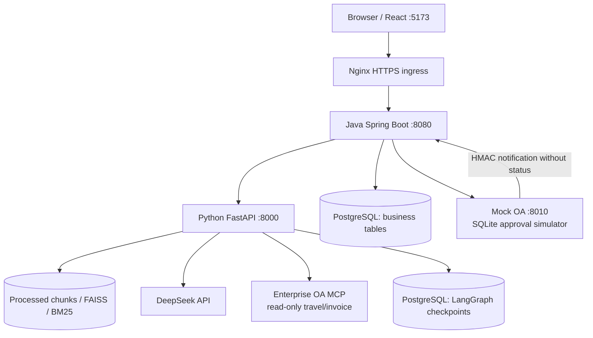
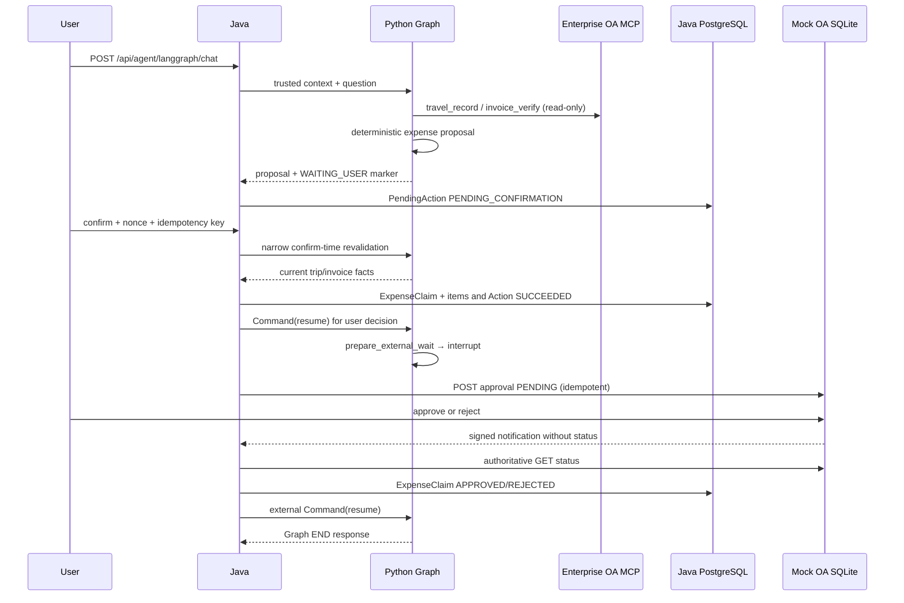

# Enterprise AI Copilot Architecture

本文是当前实现的 canonical architecture source。它描述 Java Spring Boot、Python FastAPI、PostgreSQL、Enterprise OA MCP、Mock OA 和 React 之间的真实责任边界；业务状态和权限以 Java/数据库实现为准，Checkpoint 与 Memory 都不是业务事实源。

## 1. System boundary



生产 Compose 只把 Java 绑定到宿主机入口；Python 使用 Docker 网络内的 `expose 8000`，不能绕过 Java 访问公网。开发环境可以直接访问各服务端口，但内部端点仍按内部契约使用。

| 层 | 责任 | 不负责 |
|---|---|---|
| React | 登录、conversationId、普通聊天、Proposal 确认 UI | 认证事实、权限判断、业务状态 |
| Java | JWT/身份、Admin gate、trace、超时/并发、PendingAction、业务事务、Memory 生命周期、外部状态 authority | LLM 推理、RAG 召回、Planner 决策 |
| Python | Safety Guard、RAG、LLM、Planner、Tool Executor、Checkpoint resume | 最终业务授权、业务数据库写入、Memory terminal lifecycle |
| Enterprise OA MCP | 读取当前 trip/invoice 事实 | 报销写入、审批状态 authority |
| Mock OA | 独立 SQLite 的模拟外部审批服务 | Enterprise AI Copilot 的业务事实、Java action authority |
| PostgreSQL | Java 业务表和可选 LangGraph checkpoint | 让 LLM 获得权限或替代 Java 状态机 |

## 2. Trusted runtime context

每次请求由 Java 注入并在 Python Runtime Context 中使用：

- `employee_id`：来自 `VerifiedIdentity`，不是 request body、Memory、LLM arguments 或 Tool arguments；
- `business_date`：Java 配置时区和可注入 Clock 计算；
- `trace_id`：Java 入口生成并透传；
- `conversation_id`：Java 校验客户端 hint，作为同一可信用户的 namespace；
- `X-Agent-Thread-Id`：Java 根据可信 user/conversation 生成 `rt_<sha256>`，Python 再区分 graph variant；
- `allow_eval` / `allow_business_actions`：Java capability gate 结果，Python 只消费，不接受模型扩大。

这些字段不进入保存的 AgentState，也不进入 LLM 的 `arguments`。PlannerDecision 使用严格 Pydantic schema；Tool Executor 在实际执行前再次校验结构、员工身份、能力、Tool 预算、成功签名和 retry policy。

## 3. Agent graph

### Planner-first（仓库部署默认）

`AGENT_LOOP_ENABLED=true` 时，主入口是：

```text
START → safety → planner ⇄ tool_executor → finalize → END
```

Safety Guard Lite 是深度防御过滤器，不是 authorization 或业务 validation。安全拒答不进入 Planner。Planner 每次输出一个严格 decision，当前最多 6 次 decision；Tool Executor 当前最多真正执行 5 次 Tool，成功、失败和超时均消耗执行预算。

可见 Tool 由 Runtime Context 和服务配置动态生成：`rag_answer_tool` 始终可见；Java read 配置可用时加入 leave/expense status；Enterprise OA MCP 可用时加入 travel/invoice；`allow_eval` 加入 eval；`allow_business_actions` 且有 employee 时加入 leave/expense proposal。注册表和执行器仍是最后防线。

`leave_proposal_tool` 和 `expense_proposal_tool` 只生成 Proposal 或 Clarification。它们不调用业务写 API、不生成 nonce、不改变 Java 状态。报销金额、住宿上限和 Proposal facts 由程序确定性计算，LLM 不能计算或伪造。

这两个 Proposal Tool 不依赖 `JAVA_BASE_URL` / `JAVA_INTERNAL_TOKEN`；这两个变量只用于 Python → Java 的只读业务 Tool 链路。

### Legacy Router-first（显式回退）

`AGENT_LOOP_ENABLED=false` 时使用已实现的确定性图：

```text
START → safety → router → rag | eval | action | refuse → END
```

它用于兼容性回退和对照验证，不是仓库部署的 primary path；两套图都必须汇入同一个 Java authority boundary。

## 4. RAG data path

```text
data/hr|bank|it/*.md
  → chunk builder（段落合并、长度切分、overlap、source metadata）
  → BAAI/bge-small-zh-v1.5 embeddings
  → FAISS semantic retrieval + character BM25
  → RRF fusion
  → optional Cross Encoder rerank
  → bounded prompt context
  → DeepSeek answer + sources
```

`hybrid` 是默认模式；`vector` 和 `hybrid_rerank` 用于比较。规则 Query Rewrite 只改变检索 query，原始用户问题仍用于最终 Prompt。RAG 的知识证据不能转化为业务授权；缺少证据时必须明确拒答。

## 5. Java authority and action state

受控动作当前支持 `ANNUAL_LEAVE_REQUEST` 和 `EXPENSE_CLAIM`。Python 只提交内部 Proposal；Java `BusinessActionService` 在创建时重新校验 action type、owner、日期/字段、权限、容量和业务规则。

```text
PENDING_CONFIRMATION
  ├─ confirm → PROCESSING → SUCCEEDED
  │                        └→ FAILED
  ├─ cancel  → CANCELLED
  └─ TTL     → EXPIRED
```

Java 生成一次性 `confirmationNonce`，只在创建响应返回明文，数据库只保存 SHA-256 digest。Confirm 要求 owner、nonce、TTL、当前状态和 UUID `Idempotency-Key`；成功重放返回原 `requestId`，不重复写 LeaveRequest 或 ExpenseClaim。Confirm/cancel/expire/失败时，Java 同步负责对应 Memory 的 terminal transition；Python 不写 terminal Memory。

业务数据库的关键事实：

- `PendingAction`：确认凭据、owner、conversation、action type、状态和结果；
- `LeaveRequest` / leave account：年假业务事实；
- `ExpenseClaim` / `ExpenseItem`：报销金额、trip/invoice 摘要、外部 provider/request、wait 和 resume markers；
- `source_action_id` 唯一约束防止一个动作生成多个业务写入。

## 6. Expense durable workflow



The two waits have deliberately different meanings:

| Wait | Trigger | Authority | Resume |
|---|---|---|---|
| `WAITING_USER` | complete Proposal needs explicit user decision | Java PendingAction | `POST /agent/langgraph/hitl/resume`, `Command(resume)` |
| `WAITING_EXTERNAL` | Java ExpenseClaim is already written and awaits OA | Java ExpenseClaim + OA authoritative GET | `POST /agent/langgraph/external/resume`, `Command(resume)` |

普通 Chat 不会跨过 active wait；同一 runtime thread 的 persisted wait 优先于新问题。

## 7. Confirm-time revalidation and TOCTOU

The revalidation adapter is a narrow Java → Python internal endpoint. It reads persisted Action payload, not browser fields or Memory, and checks:

1. trip ID exists, belongs to the employee, is `APPROVED`, and current start/end dates are valid and produce a current stay-night count;
2. the current invoice set exactly matches the persisted invoice IDs, with ownership accepted, `valid=true`, `duplicate=false`, amount and category unchanged;
3. Java recalculates deterministic reimbursable amount and compares it with the Proposal before opening the local write transaction.

If the facts are stale, Java marks Action `FAILED`, Memory `ABANDONED`, and the HITL decision `REJECTED`; no ExpenseClaim is created and the graph is closed safely. The normal path continues with the Java-authoritative rejected HITL resume to Graph `END`. If that resume is unavailable after the Java stale terminal commit, Java `FAILED` is not rolled back; a later Confirm against the same failed Action does not re-query OA or mutate Java state, and only retries the same deterministic `REJECTED` continuation. There is no autonomous stale-HITL worker. If the adapter is unavailable, Java keeps `PENDING_CONFIRMATION` and returns 503 so the user can retry. A small residual window remains between remote read and local commit; this is explicitly accepted for this small-scale design. Closing it requires a provider-side version/ETag, CAS, lease, execute-if-version, or transactional provider API, not a local Outbox.

## 8. External approval authority

Mock OA is independent from Java and uses SQLite. Submission is idempotent by `expense:<expenseId>` and starts `PENDING`. Approve/reject transitions are terminal and idempotent; opposite decisions conflict. The webhook contains `eventId`, `eventType` and `requestId`, but deliberately no status.

For webhook exposure, Java permits only the exact `POST /api/webhooks/mock-oa/expense-approval` path without normal user authentication. Health/version and token-protected internal read routes have separate contracts. The webhook handler validates the raw-body HMAC-SHA256 signature and timestamp window (300 seconds), strictly parses the body, then calls Mock OA `GET /api/expense-approvals/{requestId}`. Only that authoritative status can update `ExpenseClaim`; `PENDING` never regresses a terminal local claim, and a terminal decision cannot be reversed.

Reconciliation is default-off and bounded. It selects only `WAITING_APPROVAL + MOCK_OA + external_request_id`, uses a due `external_last_checked_at` compare-and-set before the out-of-transaction GET, and shares the same status-sync path as webhook processing. Submission retry and external-resume retry are separate, low-frequency, bounded workers. A failed external resume never rolls back a committed Java terminal state.

## 9. Checkpoint and crash recovery

`LANGGRAPH_CHECKPOINT_MODE` has two modes:

- `DISABLED`：不创建持久化 LangGraph runtime；适合普通本地 RAG/Agent 测试；
- `POSTGRES`：启动 `ConnectionPool + PostgresSaver + JsonPlusSerializer`，执行 `setup()` 并编译两套图；DSN、连接、setup 或图编译失败会阻止启动，不自动降级。

POSTGRES 请求使用 `durability="sync"`。恢复检查只读取 latest snapshot：

- 无 `snapshot.next` 代表新执行或已完成执行；
- 非 interrupt 恢复要求 exact raw question/fingerprint、相同 business-date anchor、相同 actor scope、当前 capability residue 安全、pending node 合法且 Tool replay-safe；通过后调用 `graph.invoke(None)`；
- `WAITING_USER` 和 `WAITING_EXTERNAL` 使用独立 marker、correlation、检查器和 `Command(resume)`；
- completed execution、legacy deterministic graph、unknown/parallel pending node、scope/date/question 冲突和不安全 Tool 均 fail-closed 为稳定 409；
- resume 保留原 execution 的 `tool_history`、计数、execution_id 和 marker，不重新 hydrate `execution_history`，也不重新跑 Planner。

最终 response contract 和有界 `execution_history` 在 `finalize_node` 内写入最后一次 Checkpoint 前完成。`execution_history` 只保存成功的 travel/invoice 等白名单摘要，在 ACTIVE Memory + task type 匹配时 hydrate，且永远标记为 `CONTEXT_ONLY`。

## Failure and recovery matrix

| Failure | Durable authority/state | Recovery |
|---|---|---|
| Python crashes mid non-interrupt graph | PostgreSQL latest Checkpoint snapshot | Exact safe `graph.invoke(None)` resume |
| Browser closes at `WAITING_USER` | Checkpoint + Java PendingAction | Later Java confirm/cancel + HITL `Command(resume)` |
| Java confirm response is lost after commit | Java BusinessAction is authoritative | Idempotent replay + HITL reconciliation |
| Confirm-time OA is unavailable | PendingAction stays `PENDING_CONFIRMATION`; Memory stays `ACTIVE`; Graph stays `WAITING_USER` | Retry the confirmation path; no business mutation |
| Confirm-time facts are stale | Java `FAILED` + Memory `ABANDONED`; no ExpenseClaim | Deterministic `REJECTED` HITL resume → Graph `END` |
| Stale Java commit succeeds but first Python `REJECTED` resume fails | Java `FAILED` remains authoritative | Repeated Confirm does not revalidate OA or mutate Java; retry the same deterministic `REJECTED` payload |
| Webhook is lost | ExpenseClaim remains `WAITING_APPROVAL` | Bounded reconciliation GET |
| Duplicate or out-of-order webhook arrives | Java terminal transition rules | Idempotent handling; no regression |
| OA is terminal but Python is unavailable | Java ExpenseClaim terminal state is retained | Durable external-resume retry |
| External resume response is lost | Python may already be at Graph `END` | Replay the exact same payload; `EXTERNAL_COMPLETED` acknowledgement |
| Python finalizer crashes after external result Checkpoint | Checkpoint contains the external result | `EXTERNAL_CONTINUATION` → deterministic finalize |
| Same runtime thread receives concurrent work | Process-local Java/Python guard | Busy/retry; no multi-instance ownership claim |

## 10. Memory and history boundaries

Memory 是 Conversation Scoped Task State Persistence，不是 Profile Memory、Preference Memory、Vector Memory 或业务真相。

```text
Java VerifiedIdentity + conversationId
  → read ACTIVE ai_task_memory
  → Python memoryContext（untrusted context）
  → Agent response
  → trigger policy
  → extractor
  → UPSERT + ACTIVE proposal
  → Java authenticated lifecycle write
```

Trigger 规则：`action_proposal` 或 Memory-eligible Tool 成功才触发；现有 ACTIVE Memory 本身不触发，纯 RAG/eval/余额/leave request/expense status/read-only MCP 成功也不触发。Python write policy 只产生 `UPSERT + ACTIVE`，不接受 `COMPLETE`、`ABANDON` 或终态业务写入；Java 负责 terminal lifecycle 和 owner scope。

| 名称 | 语义 | 不能做什么 |
|---|---|---|
| Memory | 当前会话的任务连续性 | 不能提供权限、业务当前事实或终态写入 |
| `tool_history` | 当前 execution 已执行 Tool | 不能跨请求当作历史事实 |
| `execution_history` | 有界、脱敏、`CONTEXT_ONLY` 成功摘要 | 不能用于 Tool 去重、金额、Memory trigger 或 PendingAction |
| LangGraph Checkpoint | 执行现场与恢复材料 | 不能替代 Java DB 或身份来源 |
| Java PostgreSQL | 业务状态和 Memory lifecycle authority | 不由 LLM/Python 直接写 |

## 11. Concurrency and observability

Java `AgentRuntimeThreadExecutionGuard` 在 Memory Read 前获取，覆盖 Java Agent 生命周期到响应结束；HITL/外部 resume 在 transaction commit 或 handoff 前后遵守 exact-one owner release。Python guard 覆盖 recovery inspection 到 final Checkpoint。两者都是单进程内存保护，不是多实例分布式锁；当前没有分布式 lease，也没有 event inbox/outbox 或 workflow engine。多实例首先需要 distributed execution ownership/lease；只有选择 durable event delivery 时才评估 Outbox/Inbox。

Java 生成的 trace ID 通过 `X-Trace-Id` 透传并在响应头/响应体返回。Phoenix/OpenTelemetry 默认关闭；启用时是旁路批量 trace，默认不采集 Prompt、用户输入、检索正文和模型输出，初始化或导出失败不阻断业务。

## 12. Deployment and configuration

关键默认值：

| 配置 | 默认/部署口径 |
|---|---|
| `AGENT_LOOP_ENABLED` | `true`；`false` 才回退 Router-first |
| `LANGGRAPH_CHECKPOINT_MODE` | Python 本地默认 `DISABLED`；生产 Compose 默认 `POSTGRES` |
| `business.actions.enabled` | Java 默认 `false` |
| `MEMORY_WRITE_MODE` | Python 默认 `DISABLED` |
| `MOCK_OA_ENABLED` | Java 默认 `false` |
| reconciliation/resume retry | 默认 `false` |
| `ADMIN_TOKEN` | 空值为本地 Demo eval 口径；生产 Compose 强制提供 |

完整配置和启动步骤见 [deployment.md](deployment.md)；受控动作和外部审批的本地演示见 [demo-guide.md](demo-guide.md)。

## 13. Accepted limitations

以下不是未记录的缺口，而是当前交付明确接受的边界：

- 面向小规格单机和短时受控验证，不承诺生产 SLA；
- Java/Python guard 仅 process-local，不提供多实例分布式锁或 lease；
- 不使用 Temporal、DBOS、Kafka 或消息总线；没有分布式 workflow engine；
- Java 本地数据库事务与 Enterprise OA 之间没有分布式事务；若未来需要本地事务提交后的可靠异步 command/event delivery，可评估 Transactional Outbox、外部幂等、重试、补偿和状态映射；Outbox 本身不能消除 confirm-time external-read → external-change → local-commit TOCTOU；
- Mock OA 是 SQLite 模拟服务，Enterprise OA MCP 是 fixture-backed read-only integration；生产 credentials 和正式 OA 集成未验收；
- confirm-time remote read 与本地 commit 之间有小型 TOCTOU 窗口；解决它需要 provider-side version/ETag、CAS、lease、execute-if-version 或 transactional provider API，不是 local Outbox；
- Safety Guard 是规则版深度防御，不是完整 Prompt Injection 或内容安全系统；
- 评估集和浏览器覆盖有限，容量数据不能外推为生产 QPS/P95；
- Checkpoint retention/pruning、分布式恢复租约和完整集中式 metrics/alerting 不在当前范围。

这些限制不能通过把当前系统描述为“生产级”来消除；它们分别记录在 [quality-assurance.md](quality-assurance.md) 和 [roadmap.md](roadmap.md)。
