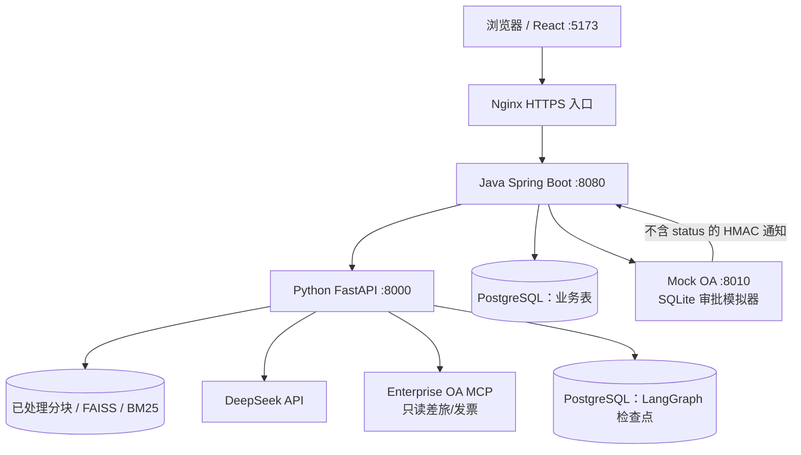
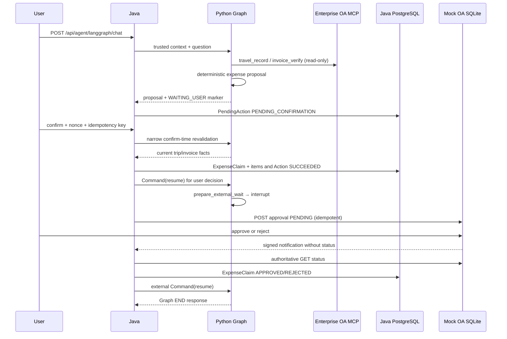

# Enterprise AI Copilot 架构

本文是当前实现的 canonical architecture source。它描述 Java Spring Boot、Python FastAPI、PostgreSQL、Enterprise OA MCP、Mock OA 和 React 之间的真实责任边界；业务状态和权限以 Java/数据库实现为准，Checkpoint 与 Memory 都不是业务事实源。

## 1. 系统边界



生产 Compose 只把 Java 绑定到宿主机入口；Python 使用 Docker 网络内的 `expose 8000`，不能绕过 Java 访问公网。开发环境可以直接访问各服务端口，但内部端点仍按内部契约使用。

| 层 | 责任 | 不负责 |
|---|---|---|
| React | 登录、conversationId、普通聊天、Proposal 确认 UI | 认证事实、权限判断、业务状态 |
| Java | JWT/身份、Admin gate、trace、超时/并发、PendingAction、业务事务、Memory 生命周期、外部状态权威 | LLM 推理、RAG 召回、Planner 决策 |
| Python | Safety Guard、RAG、LLM、Planner、Tool Executor、Checkpoint resume | 最终业务授权、业务数据库写入、Memory 终态生命周期 |
| Enterprise OA MCP | 读取当前 trip/invoice 事实 | 报销写入、审批状态权威 |
| Mock OA | 独立 SQLite 的模拟外部审批服务 | Enterprise AI Copilot 的业务事实、Java action 权威 |
| PostgreSQL | Java 业务表和 LangGraph checkpoint | 让 LLM 获得权限或替代 Java 状态机 |

## 2. 可信运行时上下文

每次请求由 Java 注入并在 Python Runtime Context 中使用：

- `employee_id`：来自 `VerifiedIdentity`，不是 request body、Memory、LLM arguments 或 Tool arguments；
- `business_date`：Java 配置时区和可注入 Clock 计算；
- `trace_id`：Java 入口生成并透传；
- `conversation_id`：Java 校验客户端 hint，作为同一可信用户的 namespace；
- `X-Agent-Thread-Id`：Java 根据可信 user/conversation 生成 `rt_<sha256>`，Python 再区分 graph variant；
- `X-Agent-Execution-Mode`：仅由 Java 注入的 `LEGACY_SINGLE` 或 `TASK_RUNTIME`；Python 放入 Runtime Context，LLM 与 AgentState 不得选择；
- `X-Agent-Task-Id`：TASK_RUNTIME 下由 Java 生成并绑定当前 TaskExecution，用于定位 task checkpoint；
- `allow_eval` / `allow_business_actions`：Java capability gate 结果，Python 只消费，不接受模型扩大；公开 `demo` 身份即使全局业务动作开关开启也固定为 `allow_business_actions=false`。

这些字段不进入保存的 AgentState，也不进入 LLM 的 `arguments`。PlannerDecision 使用严格 Pydantic schema；Tool Executor 在实际执行前再次校验结构、员工身份、能力、Tool 预算、成功签名和 retry policy。

## 3. Agent 图

### Planner-first（生产唯一入口）

主入口固定是：

```text
START → safety → planner ⇄ tool_executor → finalize → END
```

Safety Guard Lite 是深度防御过滤器，不是 authorization 或业务 validation。安全拒答不进入 Planner。Planner 每次输出一个严格 decision，当前最多 6 次 decision；Tool Executor 当前最多真正执行 5 次 Tool，成功、失败和超时均消耗执行预算。

可见 Tool 由 Runtime Context 和服务配置动态生成：`rag_answer_tool` 始终可见；Java read 配置可用时加入 leave/expense status；Enterprise OA MCP 可用时加入 travel/invoice；`allow_eval` 加入 eval；`allow_business_actions` 且有 employee 时加入 leave/expense proposal；公开 `demo` 身份不满足该 capability。注册表和执行器仍是最后防线。

`leave_proposal_tool` 和 `expense_proposal_tool` 只生成 Proposal 或 Clarification。它们不调用业务写 API、不生成 nonce、不改变 Java 状态。报销金额、住宿上限和 Proposal facts 由程序确定性计算，LLM 不能计算或伪造。

这两个 Proposal Tool 不依赖 `JAVA_BASE_URL` / `JAVA_INTERNAL_TOKEN`；这两个变量只用于 Python → Java 的只读业务 Tool 链路。

### Legacy Router-first（测试/离线兼容）

直接测试或离线对照可使用已实现的确定性图：

```text
START → safety → router → rag | eval | action | refuse → END
```

它不属于生产运行时选择；两套图都必须汇入同一个 Java authority boundary。

## 4. RAG 数据路径

```text
data/hr|bank|it/*.md
  → chunk builder（段落合并、长度切分、overlap、source metadata）
  → BAAI/bge-small-zh-v1.5 embeddings
  → FAISS semantic retrieval + character BM25
  → RRF fusion
  → optional Cross Encoder rerank
  → bounded prompt context
  → DeepSeek answer + sources
```

用户问题进入 RAG 后，生产入口先调用 `normalize_retrieval_query()`，再把 retrieval query 送入 BM25 + Vector + RRF。它只做少量口语表达的确定性语义等价规范化，不是 Intent Router 或 Planner，也不增加用户未表达的业务意图。原始用户问题仍保留给最终 Prompt、AgentState 和后续业务边界使用。

`hybrid` 是默认模式；`vector` 和 `hybrid_rerank` 用于比较。`rewrite-mode=rule` 是 Legacy Experimental Rewrite，仅供离线对照，不属于生产调用链或 CI blocking gate。RAG 的知识证据不能转化为业务授权；缺少证据时必须明确拒答。

## 5. Java 权威与动作状态

受控动作当前支持 `ANNUAL_LEAVE_REQUEST` 和 `EXPENSE_CLAIM`。Python 只提交内部 Proposal；Java `BusinessActionService` 在创建时重新校验 action type、owner、日期/字段、权限、容量和业务规则。

```text
PENDING_CONFIRMATION
  ├─ confirm → PROCESSING → SUCCEEDED
  │                        └→ FAILED
  ├─ cancel  → CANCELLED
  └─ TTL     → EXPIRED
```

Java 生成一次性 `confirmationNonce`，只在创建响应返回明文，数据库只保存 SHA-256 digest。Confirm 要求 owner、nonce、TTL、当前状态和 UUID `Idempotency-Key`；成功重放返回原 `requestId`，不重复写 LeaveRequest 或 ExpenseClaim。Confirm/cancel/expire/失败时，Java 同步负责对应 Memory 的 terminal transition；Python 不写 terminal Memory。

业务数据库的关键事实：

- `PendingAction`：确认凭据、owner、conversation、action type、状态和结果；
- `PendingAction.hitl_reconciliation_status`：仅表示 EXPIRED HITL continuation 是否仍待投递；它与业务 action 的 `status=EXPIRED` 分离，成功投递后持久化为 `RECONCILED`；
- `LeaveRequest` / leave account：年假业务事实；
- `ExpenseClaim` / `ExpenseItem`：报销金额、trip/invoice 摘要、外部 provider/request、wait 和 resume markers；
- `source_action_id` 唯一约束防止一个动作生成多个业务写入。

### 多任务 Runtime（Phase 2）

第一版只接受程序层确定性识别出的两个有序写任务。Python `/agent/tasks/decompose` 无状态返回原文连续片段；Java 校验片段顺序、任务类型和数量后创建 `TaskExecution`。`TaskExecution` 只拥有编排顺序和生命周期，不取代 LeaveRequest、ExpenseClaim 或 PendingAction 的业务权威。

入口顺序固定为 `WAITING_USER → WAITING_CLARIFICATION → 新消息 decomposition`。存在 `WAITING_CLARIFICATION` 时消息只追加到已有 `task_id` 的 clarification context，不创建新 task group；存在 `WAITING_USER` 时复用既有 task checkpoint/PendingAction，不重新分解。

Task Runtime 的关联链为 `ExpenseClaim.source_action_id → business_action.action_id ← task_execution.action_id`。`task_execution.action_id` 是可选的一对一关联字段，只用于精确定位 TaskExecution，不承载 ExpenseClaim、PendingAction 或 TaskExecution 的业务状态权威。

## 6. 报销持久化工作流

下面的时序图是 `LEGACY_SINGLE` 兼容路径。它保留 Python `prepare_external_wait → interrupt` 和 Java `/agent/langgraph/external/resume`。



这两个 wait 的含义有意区分：

| 等待状态 | 触发条件 | 权威来源 | 恢复方式 |
|---|---|---|---|
| `WAITING_USER` | 完整 Proposal 需要用户明确决定 | Java PendingAction | `POST /agent/langgraph/hitl/resume`, `Command(resume)` |
| `WAITING_EXTERNAL`（LEGACY_SINGLE） | Java ExpenseClaim 已写入，等待 OA 决定 | Java ExpenseClaim + OA 权威 GET | `POST /agent/langgraph/external/resume`, `Command(resume)` |
| `WAITING_EXTERNAL`（TASK_RUNTIME） | Java ExpenseClaim is already written and awaits OA；当前 Python task 已经 END | Java ExpenseClaim + OA authoritative GET；TaskExecution 只记录生命周期 | 不调用 Python external resume；callback 只更新 ExpenseClaim/对应 TaskExecution |

TASK_RUNTIME 的 Expense confirm 顺序是：Java PendingAction 成功 → Python 当前 task 使用 trusted `TASK_RUNTIME` context resume 并 END → Java 绑定 external correlation、将 TaskExecution 置为 `WAITING_EXTERNAL` 并提交 OA → 同组下一 Task 可由 Java 启动。OA callback/reconciliation 只通过 `ExpenseClaim.source_action_id` 定位并更新业务结果及对应 TaskExecution，禁止回写 parent queue/checkpoint、下一 task checkpoint、PendingAction 或 Memory。

普通 Chat 不会跨过 active wait；同一 runtime thread 的 persisted wait 优先于新问题。进入普通 Chat 前，Java 会在持有同一 runtime-thread guard 的情况下检查当前 owner/conversation 的 `PENDING_CONFIRMATION` TTL。若已过期，Java 在短事务内提交 `PendingAction=EXPIRED`、`Memory=ABANDONED` 和审计记录，并为有完整 HITL correlation 的新过期 action 标记 `PENDING_RECONCILIATION`；事务提交后最多投递一次确定性的 `EXPIRED` `Command(resume)`，成功后将投递状态原子收口为 `RECONCILED`，后续 Chat 不再选择该 action。临时失败仍保持待投递并允许重试；不把 `hitl_marker_invalid` 等不安全 409 直接当作成功。未过期 wait 仍保持阻断。TASK_RUNTIME 的 external callback 不关闭整个 `(user_id, conversation_id)` Memory，因为此时 ACTIVE Memory 可能属于下一 Task；普通 Java terminal authority 的 task memory 收口和下一 Task 的新 ACTIVE Memory 仍按各自 Java 生命周期执行。

## 7. 确认时重新校验与 TOCTOU

重新校验 adapter 是一个窄范围的 Java → Python 内部端点。它读取持久化的 Action payload，而不是浏览器字段或 Memory，并检查：

1. trip ID 存在、属于该员工、状态为 `APPROVED`，且当前 start/end 日期有效并能得到当前住宿夜数；
2. 当前 invoice 集合与持久化的 invoice IDs 精确匹配，归属校验通过，`valid=true`、`duplicate=false`，金额和 category 未变化；
3. Java 在开启本地写事务前重新确定性计算可报销金额，并与 Proposal 比较。

如果事实已过期，Java 将 Action 标记为 `FAILED`、Memory 标记为 `ABANDONED`，并将 HITL decision 设为 `REJECTED`；不创建 ExpenseClaim，并安全关闭图。正常路径继续通过 Java 权威的 rejected HITL resume 到达 Graph `END`。如果 Java 提交 stale 终态后该 resume 不可用，Java 的 `FAILED` 不回滚；之后针对同一个失败 Action 的 Confirm 不会再次查询 OA，也不会改变 Java 状态，只重试同一个确定性的 `REJECTED` continuation。不存在 autonomous stale-HITL worker。如果 adapter 不可用，Java 保持 `PENDING_CONFIRMATION` 并返回 503，以便用户重试。远程读取与本地提交之间仍存在一个小的残余窗口，这是该小规格设计明确接受的限制。要关闭它，需要 provider-side version/ETag、CAS、lease、execute-if-version 或 transactional provider API，而不是本地 Outbox。

## 8. 外部审批权威

Mock OA 独立于 Java 运行并使用 SQLite。提交通过 `expense:<expenseId>` 实现幂等，初始状态为 `PENDING`。批准/拒绝转换是终态且幂等；相反决定会产生冲突。webhook 包含 `eventId`、`eventType` 和 `requestId`，但有意不包含 status。

对于 webhook 暴露，Java 仅允许精确的 `POST /api/webhooks/mock-oa/expense-approval` path 不经过普通用户认证。健康检查/版本以及受 token 保护的内部读取路由各自拥有独立契约。webhook handler 校验原始 body 的 HMAC-SHA256 签名和时间窗口（300 秒），严格解析 body，然后调用 Mock OA `GET /api/expense-approvals/{requestId}`。只有这个权威 status 能更新 `ExpenseClaim`；`PENDING` 永远不会让本地终态回退，终态决定也不能反转。

D2 管理员审批台使用独立的 `Browser → Java /api/admin/mock-oa/** → Mock OA` 链路。Java 的 `/api/admin/**` 继续由已验证 JWT 的 `role=ADMIN` 授权；前端不持有 Mock OA secret、`ADMIN_TOKEN` 或 `X-Admin-Token`。生产 Compose 中 Mock OA 只加入 `ai-copilot-net` 并使用 `expose: 8010`，没有宿主机 `ports` 映射，因此公网浏览器不能直接访问 Mock OA。

Reconciliation 和 retry delivery 是相互独立、低频且有界的 worker。它们只选择各自持久化的候选集合；`MOCK_OA_ENABLED=false` 时 Mock OA provider 继续 fail-closed。Reconciliation 在事务外 GET 之前，先对到期的 `external_last_checked_at` 执行 compare-and-set，并与 webhook 处理共用同一 status-sync 路径。external resume 失败永远不会回滚已提交的 Java 终态。

## 9. Checkpoint 与崩溃恢复

LangGraph runtime 固定使用 PostgreSQL：启动 `ConnectionPool + PostgresSaver + JsonPlusSerializer`，执行 `setup()` 并编译持久化图；DSN、连接、setup 或图编译失败会阻止启动，不自动降级。

POSTGRES 请求使用 `durability="sync"`。恢复检查只读取 latest snapshot：

- 无 `snapshot.next` 代表新执行或已完成执行；
- 非 interrupt 恢复要求 exact raw question/fingerprint、相同 business-date anchor、相同 actor scope、当前 capability residue 安全、pending node 合法且 Tool replay-safe；通过后调用 `graph.invoke(None)`；
- `WAITING_USER` 和 `WAITING_EXTERNAL` 使用独立 marker、correlation、检查器和 `Command(resume)`；
- completed execution、legacy deterministic graph、unknown/parallel pending node、scope/date/question 冲突和不安全 Tool 均 fail-closed 为稳定 409；
- resume 保留原 execution 的 `tool_history`、计数、execution_id 和 marker，不重新 hydrate `execution_history`，也不重新跑 Planner。

最终 response contract 和有界 `execution_history` 在 `finalize_node` 内写入最后一次 Checkpoint 前完成。`execution_history` 只保存成功的 travel/invoice 等白名单摘要，在 ACTIVE Memory + task type 匹配时 hydrate，且永远标记为 `CONTEXT_ONLY`。

## 故障与恢复矩阵

| 故障 | 持久化权威/状态 | 恢复方式 |
|---|---|---|
| Python 在非 interrupt 图执行中途崩溃 | PostgreSQL 最新 Checkpoint snapshot | 安全地精确执行 `graph.invoke(None)` resume |
| 浏览器在 `WAITING_USER` 时关闭 | Checkpoint + Java PendingAction | 之后执行 Java confirm/cancel + HITL `Command(resume)` |
| Java confirm 在提交后响应丢失 | Java BusinessAction 是权威来源 | 幂等重放 + HITL reconciliation |
| 确认时 OA 不可用 | PendingAction 保持 `PENDING_CONFIRMATION`；Memory 保持 `ACTIVE`；Graph 保持 `WAITING_USER` | 重试确认路径；不改变业务状态 |
| 确认时事实已过期 | Java `FAILED` + Memory `ABANDONED`；不创建 ExpenseClaim | 确定性的 `REJECTED` HITL resume → Graph `END` |
| Java stale 提交成功但第一次 Python `REJECTED` resume 失败 | Java `FAILED` 仍是权威状态 | 重复 Confirm 不重新校验 OA 或改变 Java；重试同一个确定性的 `REJECTED` payload |
| webhook 丢失 | ExpenseClaim 保持 `WAITING_APPROVAL` | 有界 reconciliation GET |
| webhook 重复或乱序到达 | Java 终态转换规则 | 幂等处理；不发生回退 |
| OA 已到终态但 Python 不可用（LEGACY_SINGLE） | 保留 Java ExpenseClaim 终态 | 持久化 external-resume retry |
| external resume 响应丢失（LEGACY_SINGLE） | Python 可能已经到达 Graph `END` | 重放完全相同的 payload；返回 `EXTERNAL_COMPLETED` acknowledgement |
| Python finalizer 在 external result Checkpoint 之后崩溃（LEGACY_SINGLE） | Checkpoint 包含 external result | `EXTERNAL_CONTINUATION` → 确定性 finalize |
| 下一个 Task 活跃时收到 TASK_RUNTIME external callback | ExpenseClaim 是业务权威；TaskExecution 仅用于关联/生命周期 | 只更新 ExpenseClaim + 关联的 TaskExecution；不调用 Python external resume，也不写 Memory/checkpoint |
| 同一 runtime thread 收到并发工作 | Java/Python 进程内 guard | busy/retry；不宣称多实例所有权 |
| 过期的 `WAITING_USER` 阻断新 Chat | Java `PendingAction` TTL + `hitl_reconciliation_status` + Memory 终态转换 | 提交 `EXPIRED`/`ABANDONED`，成功投递后持久化 `RECONCILED`，然后启动新 Chat；临时失败才重试 |

## 10. Memory 与历史边界

Memory 是 Conversation Scoped Task State Persistence，不是 Profile Memory、Preference Memory、Vector Memory 或业务真相。

```text
Java VerifiedIdentity + conversationId
  → read ACTIVE ai_task_memory
  → Python memoryContext（untrusted context）
  → Agent response
  → trigger policy
  → extractor
  → UPSERT + ACTIVE proposal
  → Java authenticated lifecycle write
```

Trigger 规则：`action_proposal` 或 Memory-eligible Tool 成功才触发；现有 ACTIVE Memory 本身不触发，纯 RAG/eval/余额/leave request/expense status/read-only MCP 成功也不触发。Python write policy 只产生 `UPSERT + ACTIVE`，不接受 `COMPLETE`、`ABANDON` 或终态业务写入；Java 负责 terminal lifecycle 和 owner scope。普通 Agent proposal/upsert 不重新激活终态 Memory；Java 仅在已确定当前响应开启新的 Expense reason clarification cycle 时，通过显式新周期入口创建 `ACTIVE` 的 `EXPENSE_REQUEST` Memory，并以当前新 Q1 作为 `original_request`。后续 Q2 只补 `reason`，不能覆盖 Q1。

| 名称 | 语义 | 不能做什么 |
|---|---|---|
| Memory | 当前会话的任务连续性 | 不能提供权限、业务当前事实或终态写入 |
| `tool_history` | 当前 execution 已执行 Tool | 不能跨请求当作历史事实 |
| `execution_history` | 有界、脱敏、`CONTEXT_ONLY` 成功摘要 | 不能用于 Tool 去重、金额、Memory trigger 或 PendingAction |
| LangGraph Checkpoint | 执行现场与恢复材料 | 不能替代 Java DB 或身份来源 |
| Java PostgreSQL | 业务状态和 Memory lifecycle authority | 不由 LLM/Python 直接写 |

## 11. 并发与可观测性

Java `AgentRuntimeThreadExecutionGuard` 在 Memory Read 前获取，覆盖 Java Agent 生命周期到响应结束；HITL/外部 resume 在 transaction commit 或 handoff 前后遵守 exact-one owner release。Python guard 覆盖 recovery inspection 到 final Checkpoint。两者都是单进程内存保护，不是多实例分布式锁；当前没有分布式 lease，也没有 event inbox/outbox 或 workflow engine。多实例首先需要 distributed execution ownership/lease；只有选择 durable event delivery 时才评估 Outbox/Inbox。

Java 生成的 trace ID 通过 `X-Trace-Id` 透传并在响应头/响应体返回。Phoenix/OpenTelemetry 默认关闭；启用时是旁路批量 trace，默认不采集 Prompt、用户输入、检索正文和模型输出，初始化或导出失败不阻断业务。

## 12. 部署与配置

关键默认值：

| 配置 | 默认/部署口径 |
|---|---|
| Planner-first Agent graph | 生产入口固定使用；legacy 图仅测试/离线兼容 |
| `LANGGRAPH_CHECKPOINT_DSN` | 必填；连接失败即不就绪 |
| `business.actions.enabled` | Java 默认 `false` |
| `MEMORY_WRITE_MODE` | Python 默认 `DISABLED` |
| `MOCK_OA_ENABLED` | Java 默认 `false` |
| reconciliation/resume retry | 始终低频调度；由 `MOCK_OA_ENABLED` 控制 provider 可用性，间隔/批量参数限流 |
| `ADMIN_TOKEN` | server-only 业务动作 hardening Token；浏览器不接触，生产 Compose 强制提供 |

完整配置和启动步骤见 [deployment.md](deployment.md)；受控动作和外部审批的本地演示见 [demo-guide.md](demo-guide.md)。

## 13. 已接受的限制

以下不是未记录的缺口，而是当前交付明确接受的边界：

- 面向小规格单机和短时受控验证，不承诺生产 SLA；
- Java/Python guard 仅 process-local，不提供多实例分布式锁或 lease；
- 不使用 Temporal、DBOS、Kafka 或消息总线；没有分布式 workflow engine；
- Java 本地数据库事务与 Enterprise OA 之间没有分布式事务；若未来需要本地事务提交后的可靠异步 command/event delivery，可评估 Transactional Outbox、外部幂等、重试、补偿和状态映射；Outbox 本身不能消除 confirm-time external-read → external-change → local-commit TOCTOU；
- Mock OA 是 SQLite 模拟服务，Enterprise OA MCP 是 fixture-backed read-only integration；生产 credentials 和正式 OA 集成未验收；
- confirm-time remote read 与本地 commit 之间有小型 TOCTOU 窗口；解决它需要 provider-side version/ETag、CAS、lease、execute-if-version 或 transactional provider API，不是 local Outbox；
- Safety Guard 是规则版深度防御，不是完整 Prompt Injection 或内容安全系统；
- 评估集和浏览器覆盖有限，容量数据不能外推为生产 QPS/P95；
- Checkpoint retention/pruning、分布式恢复租约和完整集中式 metrics/alerting 不在当前范围。

这些限制不能通过把当前系统描述为“生产级”来消除；它们分别记录在 [quality-assurance.md](quality-assurance.md) 和 [roadmap.md](roadmap.md)。
