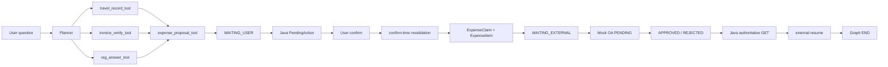

# Controlled Business Actions

本文说明当前两个受控动作：`ANNUAL_LEAVE_REQUEST` 和 `EXPENSE_CLAIM`。它们共享 Java authority，但业务事实不同。Python/LLM 只能提出 Proposal；任何写操作都必须经过 Java 的 PendingAction、nonce、权限、幂等和数据库事务。

## 1. Common contract

```text
Python Proposal / Clarification
  → Java validation
  → PENDING_CONFIRMATION
  → explicit user confirm
  → PROCESSING
  → SUCCEEDED | FAILED

cancel → CANCELLED
TTL     → EXPIRED
```

Proposal 和 Clarification 都没有业务副作用。缺字段只返回 `missing_fields`，不创建 PendingAction。完整 Proposal 由 Java 再校验，并以当前认证用户、conversation 和业务日期为范围。

Java 负责：

- `BusinessActionType` 白名单、字段、日期、权限、容量和业务规则；
- `confirmationNonce` 生成（32-byte `SecureRandom`），数据库只存 SHA-256 digest；
- PendingAction 状态、TTL、owner/correlation、`source_action_id` 唯一约束；
- Confirm 的 owner、nonce、TTL、状态和 UUID `Idempotency-Key`；
- 业务数据库事务和最终结果；
- Confirm/cancel/expire/失败后的 Java Memory lifecycle transition。

Confirm 成功的重复请求重放原 `requestId`，不会重复扣余额、创建 LeaveRequest 或 ExpenseClaim。Confirm body 只允许 `confirmationNonce`，不接受浏览器传入的 employee、金额、权限或业务事实。

## 2. Planner and Router paths

```text
生产入口固定 Planner-first
  safety → planner ⇄ tool_executor → proposal → Java PendingAction

测试/离线兼容图
  safety → router → action → proposal → Java PendingAction
```

Planner-first 是生产唯一入口；Router-first 仅供直接测试/离线对照。两者最终都调用同一 Java control plane。

Planner 受最多 6 次 decision、最多 5 次实际 Tool execution 的独立预算约束。可见 Tool 由程序按 Runtime Context 收缩，模型不能扩大权限。`leave_proposal_tool`、`expense_proposal_tool` 只生成 Proposal，不调用 Java 写接口；可信员工身份、日期和 trace 由程序注入。公开 `demo` 身份即使全局业务动作开关开启，也固定为只读，不获得 Proposal Tool。

Proposal Tool 不依赖 `JAVA_BASE_URL` / `JAVA_INTERNAL_TOKEN`；这两个配置只属于 Python → Java 的只读业务 Tool 链路。

## 3. Annual leave

年假 Proposal 由确定性日期/原因解析生成。Java 再校验：

- 开始日期不早于当前 business date，跨度和日期顺序合法；
- reason 长度和字符安全；half-day 只能用于单个工作日；
- 工作日天数、余额和同一员工的日期冲突；
- action owner、conversation scope 和业务功能开关。

Confirm 在一个 PostgreSQL 事务内锁定账户和 Action，写入 LeaveRequest、扣减余额并保存成功结果；任何数据库异常整体回滚。当前 Demo 不处理法定节假日和调休，Manager 也没有审批或查看他人申请的权限。

## 4. Expense primary workflow



实际顺序是：

1. `travel_record_tool` 和 `invoice_verify_tool` 通过 Enterprise OA MCP 读取当前事实；它们是 read-only，不触发 Memory。
2. `expense_proposal_tool` 只消费已成功 Tool 的结构化 observations。它不重新调用 MCP、Java 或 RAG；住宿上限、天数、金额由程序确定性计算。
3. Python 在 `prepare_hitl → interrupt` 前以同步 durability 保存 `WAITING_USER` marker。Java 按 `agent_execution_id + hitl_wait_id` 幂等注册 PendingAction。
4. 用户 Confirm 后，Java 在本地写事务前执行 confirm-time revalidation；通过后在同一 Java 事务写 `ExpenseClaim` 和 `ExpenseItem`，并将 BusinessAction 置为 `SUCCEEDED`。
5. Java 事务提交后，Python 用 `Command(resume)` 收口用户确认；Planner/Tool 不重跑。确认成功的 Expense execution 随后进入 `prepare_external_wait → external_wait(interrupt)`。
6. Java 在事务外向 Mock OA 提交带 `Idempotency-Key: expense:<expenseId>` 的 PENDING approval，并把本地 claim 绑定到 `external_request_id`。
7. Mock OA 被 approve/reject 后发送不含 status 的签名通知；Java 通过 webhook 或 reconciliation 调用 Mock OA GET，唯一以该状态更新本地 claim。
8. Java 本地 ExpenseClaim 终态提交后，才调用 Python external resume。Python 严格校验 wait/execution/action/request correlation，用 `Command(resume)` 进入 Graph END。

## 5. Confirm-time revalidation

这是一个 Java → Python 的窄内部适配器，payload 来自持久化 Action，不来自浏览器或 Memory。它重新取得当前 OA facts，检查：

| 事实 | 校验 |
|---|---|
| Trip | ID 存在、employee ownership、状态 `APPROVED`、当前 start/end 日期有效，并重新计算 stay nights |
| Invoices | ID 集合精确匹配、归属正确、`valid=true`、`duplicate=false`、金额和 category 未变 |
| Amount | Java 根据当前 facts 确定性重算 claimed/reimbursable，与 Proposal 一致 |

结果分三类：

- **Fresh**：进入 Java 本地事务，写入 ExpenseClaim/Items；
- **Stale**：Action=`FAILED`、Memory=`ABANDONED`、HITL=`REJECTED`，不创建 ExpenseClaim，正常路径通过 REJECTED resume 到 Graph `END`；若 stale 终态已在 Java 提交但 Python resume 失败，Java `FAILED` 保留，重复 Confirm 不重新校验 OA 或改变 Java 状态，只重试同一个确定性的 REJECTED continuation；没有 autonomous stale-HITL worker；
- **Unavailable**：保留 `PENDING_CONFIRMATION`，返回 503，可重试；不伪造 FAILED。

远程读取完成到本地事务提交之间仍有小型 TOCTOU 窗口，这是当前小规格方案明确接受的限制。Local Transactional Outbox 不能消除该窗口；若未来需要关闭它，必须由 provider 提供 version token/ETag、CAS、lease、execute-if-version 或 transactional API。Transactional Outbox 只在本地事务提交后需要可靠异步发布 command/event 时评估。

## 6. WAITING_USER is not WAITING_EXTERNAL

| 维度 | `WAITING_USER` | `WAITING_EXTERNAL` |
|---|---|---|
| 含义 | 用户是否确认 Proposal | 外部 OA 是否批准已提交 ExpenseClaim |
| Java authority | PendingAction | ExpenseClaim + Mock OA authoritative GET |
| Python marker | `BUSINESS_ACTION_CONFIRMATION` | `EXPENSE_APPROVAL` |
| Python endpoint | `/agent/langgraph/hitl/resume` | `/agent/langgraph/external/resume` |
| resume payload | Action decision/status | OA decision/status/request |
| 普通 Chat | 不得跨过 | 不得跨过 |

两种 wait 都需要严格 schema、correlation 和当前 runtime thread。HITL Confirm/Cancel 与 external resume 都不运行 Memory proposal pipeline。

普通 Chat 开始前，Java 先检查同一 owner/conversation 的 `PENDING_CONFIRMATION` TTL。过期的 `WAITING_USER` 在 Java 短事务内变为 `EXPIRED`，对应 Memory 变为 `ABANDONED` 并写审计；事务提交后才通过原有 HITL resume endpoint 发送确定性的 `EXPIRED` decision，收口旧 Graph，然后继续当前 Chat。未过期 wait 仍阻断新 Chat；resume 失败时当前 Chat 不启动，后续请求重试同一 continuation。

## 7. Mock OA, webhook and reconciliation

Mock OA 独立运行在 `:8010`，使用 SQLite 保存 idempotency key、payload hash、request ID 和 status：

```text
POST /api/expense-approvals             → PENDING
GET  /api/expense-approvals/{requestId} → current status
POST /api/admin/expense-approvals/{id}/approve
POST /api/admin/expense-approvals/{id}/reject
```

Submit 的相同 key + 相同 payload 返回同一 request；payload 冲突返回 409。审批只允许 `PENDING → APPROVED/REJECTED`，相同终态重放，反向决定冲突。终态事务提交后才 best-effort webhook；webhook 只发送 `eventId`、event type 和 request ID，不发送 status。

Java webhook 的唯一路径是 `POST /api/webhooks/mock-oa/expense-approval`。它在 Spring Security 中只对这一个精确 POST path permitAll，然后验证：

1. 原始 body 的 `timestamp + "." + rawBody` HMAC-SHA256；
2. timestamp 与当前时间不超过 300 秒；
3. 严格 DTO、event type 和 request ID；
4. 通过 `external_request_id` 调 Mock OA authoritative GET。

认证失败返回 401，body 不合法返回 400，status sync 失败返回 502。通知本身没有状态 authority，伪造或过期通知不能直接改变 ExpenseClaim。

Reconciliation worker 始终按默认 60 秒、批量 20（代码限制 1–100）低频运行。候选只包含 `WAITING_APPROVAL + MOCK_OA + external_request_id`，先对 `external_last_checked_at` 做 due CAS 并提交，再在事务外 GET；provider 关闭或查询失败时 fail-closed，Webhook 与 reconciliation 共用同一 status-sync service。Submission retry 与 external-resume retry 也始终运行并独立限批。

## 8. External resume failure semantics

Java 只有在 ExpenseClaim 的 `APPROVED/REJECTED` 终态事务提交后才构建 external resume payload。payload 从持久化 correlation 重建 owner/conversation/employee/execution/wait/request，能力固定为 false，避免恢复路径重新进入 Planner 或业务 Tool。

Python 可能处于三种安全状态：

- `WAITING_EXTERNAL`：等待 Java authoritative decision；
- `EXTERNAL_CONTINUATION`：decision 已消费，finalizer 仍待完成；
- `EXTERNAL_COMPLETED`：已收口，再次投递为幂等 no-op。

Java 的 `external_resume_last_attempt_at` / `external_resume_completed_at` 只负责投递和重试记录。Python 不可用、响应丢失或 finalizer crash 都不能回滚 Java 终态。

## 9. Configuration

| 配置 | 默认值 |
|---|---|
| `business.actions.enabled` | `false` |
| `business.actions.require-admin` | `false`；`true` 时额外要求内部请求提供 `ADMIN_TOKEN`，浏览器不发送该 Token |
| `business.actions.ttl-seconds` | `600` |
| Planner-first Agent graph | 生产固定；Router-first 仅测试/离线兼容 |
| `LANGGRAPH_CHECKPOINT_DSN` | 必填；PostgreSQL 初始化失败即 fail-closed |
| `MEMORY_WRITE_MODE` | `DISABLED` |
| `MOCK_OA_ENABLED` | `false` |
| reconciliation / external resume retry | 始终低频调度；provider 由 `MOCK_OA_ENABLED` 控制 |

## 10. Accepted boundaries

- 当前仅用于小规格单机和短时受控演示，不承诺生产 SLA；
- Java/Python runtime guard 仅 process-local，多实例需要 distributed lease/lock；
- 没有 Temporal、DBOS、Kafka、Redis 或其他分布式 workflow/lock；
- 本地 Java PostgreSQL 与真实 Enterprise OA 没有分布式事务，当前使用 Mock OA 模拟外部闭环；
- Enterprise OA MCP 为 fixture-backed read-only 集成，真实生产凭据和正式 OA 集成未验收；
- confirm-time remote read 与本地 commit 之间存在小型 TOCTOU 窗口；
- Checkpoint retention/pruning、完整 metrics/alerting 和生产容量基线不在当前范围；多实例 execution lease 与 event delivery/inbox/outbox 是不同的后续议题。
