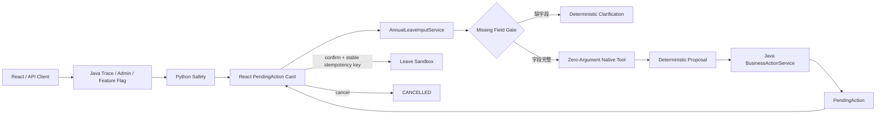

# Controlled Business Actions

## 定位与边界

该能力是内存 Sandbox，目前只支持 `ANNUAL_LEAVE_REQUEST`。它不接真实 OA，不新增数据库、Redis 或消息队列；服务重启后 PendingAction、模拟余额和 LeaveRequest 全部清空。React 会展示脱敏后的 PendingAction 确认卡，并由用户显式确认或取消草稿。

Feature Flag `business.actions.enabled` 默认关闭。共享 Admin Token 只用于演示访问控制，不代表员工身份认证。当前不支持分布式幂等，也不处理中国法定节假日与调休。

## 真实调用链



Safety 先于 Evaluation，Evaluation 先于 Annual Leave Action，其他请求继续进入 RAG。年假政策、余额、结转和审批流程查询不会进入 Action Tool。

## 零参数 Native Tool

`plan_annual_leave_request` 是零参数受控协议节点，不是字段抽取器、业务事实来源或写操作 Tool。LLM 不接收用户原始问题、日期、reason、half-day、traceId、policy context、员工信息、余额或 Admin Token，也不负责生成 Proposal。

最终契约：

```text
tool_name=plan_annual_leave_request
tool_count=1
parameters=omitted
tool_choice=Named
thinking=disabled
strict=omitted
retry_policy=none
max_attempts=1
max_tokens=64
provider_received_business_data=NO
```

Python 先确定性解析日期、明确原因表达和半天表达。缺少日期或原因时，Python 直接返回固定 Clarification，Provider 调用次数为 0。字段完整时，Provider 只需返回一个指定函数调用，且 `arguments` 必须能解析为严格空对象 `{}`；非空 Object、Array、非法 JSON、错误 Tool 名或多个 Tool Call 都会被拒绝。代码不读取 `message.content`，也不重试。

协议成功后，Proposal 的 `start_date`、`end_date`、`reason` 和 `half_day` 全部来自 Python 确定性分析结果。Provider 超时、连接失败、状态错误或 Tool 协议错误时不会生成草稿。

该设计的生产代价是：完整字段 Action 会额外依赖一次外部 Provider 调用；Provider 不可用时草稿生成失败；Native Tool 本身不增加业务语义，只提供可观测的协议门禁。

## Java 权威控制面

Java 使用入口 `TraceIdFilter` 生成的 traceId 作为 `PendingAction.originTraceId`，不信任 Python 响应中的 traceId。Admin Token 仅在 Java 内校验，不下传 Python。Java 使用配置时区的可注入 `Clock` 计算业务日期，并重新校验：

- Action 类型、日期完整性和日期顺序；
- 开始日期不得早于业务日期，跨度不超过 31 个日历日；
- reason 为 1 到 200 个非控制字符；
- 半天仅允许单个工作日；
- 工作日天数、余额和已有申请冲突。

整日申请只统计周一至周五，半天为 `0.5` 天。固定 Demo Actor 为 `DEMO-001 / Demo User / ANNUAL`。

PendingAction 状态机：

```text
PENDING_CONFIRMATION
  ├─ confirm → PROCESSING → SUCCEEDED
  │                        └→ FAILED
  ├─ cancel  → CANCELLED
  └─ timeout → EXPIRED
```

确认 nonce 由 32 字节 `SecureRandom` 生成，明文只在创建响应返回；服务端只保存 SHA-256 摘要并使用常量时间比较。confirm 要求 UUID `Idempotency-Key`。状态转换以 PendingAction 为同步边界，Sandbox 在临界区内重新检查余额和冲突、扣减余额并创建 LeaveRequest，重复确认不会再次执行。

confirm/cancel 请求体只允许 `confirmationNonce`，额外业务字段会被拒绝。PendingAction、confirm、cancel 及 Action 错误响应均使用 `Cache-Control: no-store`。

## React 人工确认链路

前端收到 PendingAction 后立即把 `confirmationNonce` 从可渲染响应中拆出，仅保存到当前页面生命周期内的 `useRef(Map)`；公开消息状态和 `PendingActionCard` props 中不包含 nonce。nonce、Admin Token 和幂等 Key 都不会写入 DOM、URL、日志、`localStorage` 或 `sessionStorage`。

Confirm 首次点击使用 `crypto.randomUUID()` 生成幂等 Key，并按消息保存在页面内存。网络失败、HTTP 502/503 或可重试服务端错误后，重试确认复用原 Key，避免服务端已成功但客户端未收到结果时重复执行。Cancel 不发送 `Idempotency-Key`。同步 `Set` 锁在 React 状态更新前生效，防止确认或取消的快速双击产生多个请求。

卡片状态为 `pending → confirming → succeeded` 或 `pending → cancelling → cancelled`；过期草稿进入 `expired`，可重试错误进入 `error` 并且只显示与上一次决定一致的重试按钮。客户端到期计时用于提前禁用交互，服务端 `ACTION_EXPIRED` 仍是权威结果。执行中的动作会禁用清空会话和模式切换。

## 配置

| 配置 | 默认值 |
|---|---:|
| `business.actions.enabled` | `false` |
| `business.actions.require-admin` | `true` |
| `business.actions.ttl-seconds` | `600` |
| `business.actions.max-pending` | `100` |
| `business.actions.max-completed` | `500` |
| `business.actions.demo-annual-leave-balance` | `5.0` |
| `business.actions.timezone` | `Asia/Shanghai` |

仓库使用惰性过期和有界容量，不创建后台线程。审计日志记录 traceId、originTraceId、actionId、状态变化、结果码和 requestId，不记录 Admin Token、nonce、nonce 摘要或完整 reason。
