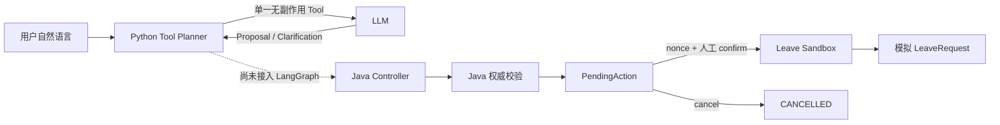

# Controlled Business Actions

## 边界

该能力是 v0.5.0 的内存 Sandbox，仅支持 `ANNUAL_LEAVE_REQUEST`。它不接真实 OA，不新增数据库、Redis 或消息队列，服务重启后 PendingAction、模拟余额和 LeaveRequest 全部重置。

当前使用共享 Admin Token 控制访问，不代表员工身份认证。Feature Flag `business.actions.enabled` 默认关闭，生产 Compose 同样保持关闭。React 确认卡与 Python LangGraph action 路由尚未实现。

## 调用链



LLM 只看到 `plan_annual_leave_request`，没有 submit、approve、update、cancel 或 execute Tool。Python 不写业务状态，也不生成 actionId、nonce、requestId、余额或审批结果。

Tool Planner 固定使用：

```text
tool_count=1
tool_choice=required
thinking.type=disabled
strict=false
```

关闭 Thinking 仅应用于专用 Tool Planner，不影响普通 RAG 调用。

## Java 控制面

Java 固定 Demo Actor 为 `DEMO-001 / Demo User / ANNUAL`，使用配置时区的可注入 `Clock` 计算权威业务日期。Java 重新校验日期、31 天跨度、reason、半天规则、工作日、余额与冲突；不信任模型提供的派生值。

整日申请只统计周一至周五，半天为 `0.5` 天且只能发生在单个工作日。不处理中国法定节假日和调休。

PendingAction 状态机：

```text
PENDING_CONFIRMATION
  ├─ confirm → PROCESSING → SUCCEEDED
  │                        └→ FAILED
  ├─ cancel  → CANCELLED
  └─ timeout → EXPIRED
```

确认 nonce 由至少 32 字节 `SecureRandom` 生成，明文只在创建响应返回一次；服务端只保存 SHA-256 摘要并使用常量时间比较。确认需要 UUID `Idempotency-Key`。状态转换以 PendingAction 为同步边界，Sandbox 在一个临界区内重新检查余额和冲突、扣减余额并创建 LeaveRequest，保证双击不会重复执行。

仓库使用惰性过期和有界容量，不创建后台线程。达到 Pending 上限时拒绝新建，完成记录超过上限时删除最旧项。

## 配置

| 配置 | 默认值 |
|---|---:|
| `business.actions.enabled` | `false` |
| `business.actions.require-admin` | `true` |
| `business.actions.ttl-seconds` | `600` |
| `business.actions.max-pending` | `100` |
| `business.actions.max-completed` | `500` |
| `business.actions.demo-annual-leave-balance` | `5.0` |
| `business.actions.timezone` | `Asia/Shanghai` |

所有动作响应禁止缓存。审计日志只记录 traceId、originTraceId、actionId、状态变化、结果码和 requestId，不记录 Admin Token、nonce、摘要或完整 reason。
