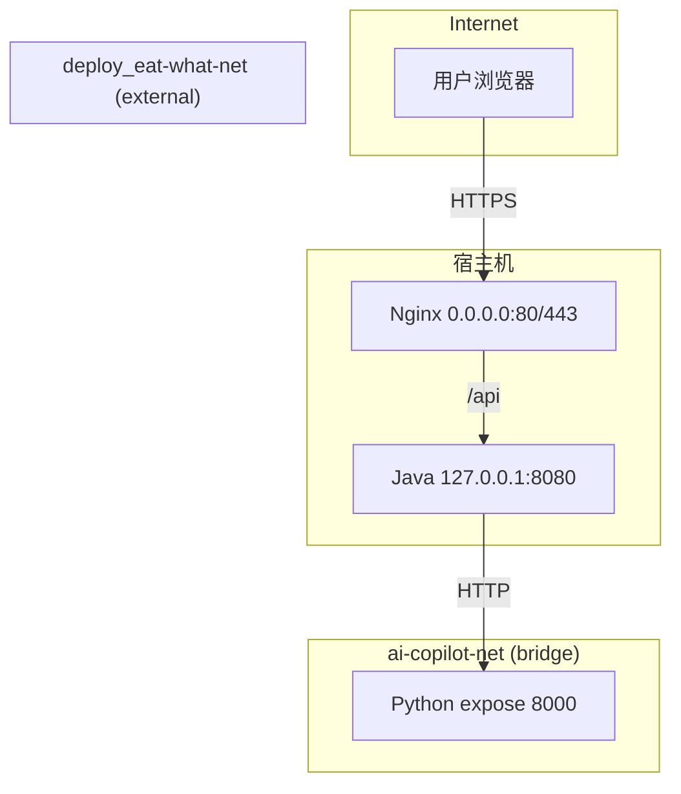
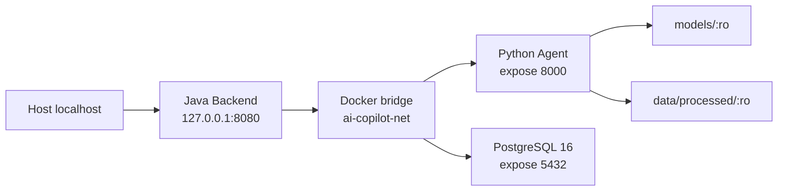

# Deployment

## 验证环境

本次部署验证在腾讯云小规格实例上完成，环境如下：

| 项目 | 配置 |
|------|------|
| 操作系统 | Ubuntu 22.04 |
| Docker | 26.1.3 |
| Docker Compose | v2.27.1 |
| 总内存 | 3.3 GiB |
| 部署前可用内存 | 约 1.2 GiB |
| 根分区 | 40 GiB，约 29 GiB 可用 |
| Swap | 4 GiB（部署时创建） |
| swappiness | 10 |

> 注意：以上为本次验证环境，不是最低官方要求。

## 部署方式

采用**本地构建 + 上传**方式，不在服务器执行重型构建。

### 构建流程

1. 本地构建 Docker 镜像
2. `docker save` 导出为 tar 文件
3. gzip 压缩
4. SHA-256 校验
5. SCP 上传到服务器
6. 服务器 `docker load` 加载镜像

构建 Java 和 Python 镜像时使用相同的版本参数，例如：

```bash
--build-arg APP_VERSION=0.4.1-dev \
--build-arg GIT_COMMIT="$(git rev-parse HEAD)" \
--build-arg BUILD_TIME="$(date -u +%Y-%m-%dT%H:%M:%SZ)"
```

生产发布应传入正式版本号、完整 Commit SHA 和 UTC 构建时间。Java 可通过
`/api/version` 查询，Python 内部可通过 `/agent/version` 查询；两个接口均不返回 Secret。
生产 `.env` 应设置 `JAVA_IMAGE` 和 `PYTHON_IMAGE`，值使用版本号与 Git 短 SHA
组成的不可变标签。

### 镜像

| 镜像 | 说明 |
|------|------|
| enterprise-ai-copilot-python:6e24f52 | Python Direct ONNX 生产镜像 |
| enterprise-ai-copilot-java:6e24f52 | Java Backend 生产镜像 |

## 目录结构

```
/opt/enterprise-ai-copilot/
├── models/
│   └── bge-small-zh-v1.5-onnx/    # ONNX 模型文件（只读挂载）
│       ├── onnx/model.onnx
│       ├── tokenizer.json
│       └── 1_Pooling/config.json
├── data/
│   ├── processed/                  # 知识库数据（只读挂载）
│   │   ├── faiss.index
│   │   ├── faiss_metadata.json
│   │   ├── chunks.json
│   │   └── embeddings.json
│   └── eval/
│       └── reports/                # 评估报告（只读挂载到 Python 容器）
│           ├── retrieval_eval_report.json
│           └── generation_eval_report.json
├── deploy/
│   ├── docker-compose.prod.yml
│   └── .env                        # 权限 600
├── releases/                       # 发布产物（临时）
└── backups/                        # 配置备份
```

## 模型部署

### 模型信息

- 模型：BAAI/bge-small-zh-v1.5
- 格式：ONNX FP32
- 维度：512
- Runtime：Direct ONNX Runtime（不加载 Torch）
- Provider：CPUExecutionProvider

### 部署要求

- 模型文件不进 Git
- 只读挂载到容器
- 校验 SHA-256 一致性
- 不在服务器在线导出

### SHA-256 校验

```
model.onnx: f2220ab6b0959ee6ecf4c52dc793a77798aefa98f267f5bcce15c497612d4238
```

## 代码能力 vs 仓库部署默认 vs 公网实际状态

> 本节是本仓库对当前部署能力的唯一事实口径。**公网实际状态仓库无证据** —— 公网是否启用 Planner-first / 受控业务动作 / 只读企业 Tool，以运维 `.env` 与服务器实际环境变量为准，本文不据此做能力宣称。

| 维度 | main 代码能力（已实装） | 仓库部署默认（`deploy/docker-compose.prod.yml` + `agent-python/.env.example`） | 公网实际状态 |
|------|------------------------|------------------------------------------------------------------------|--------------|
| Python Agent 状态图 | 两套互斥图：`safety → router → rag|eval|action|refuse`（legacy Router-first）和 `safety → planner ⇄ tool_executor`（Planner-first），由 `AGENT_LOOP_ENABLED` 切换 | `AGENT_LOOP_ENABLED` 在 compose 中 **未注入**；镜像内 `.env.example` 与 `app/core/config.py` 默认 `false` ⇒ 走 legacy Router-first | 仓库无证据 |
| Planner-first 可见 Tool（最多 5 个，按权限动态收缩） | 默认 3 个：`rag_answer_tool` / `leave_balance_tool` / `leave_request_tool`；`allow_eval=true` 追加 `eval_report_tool`；`allow_business_actions=true` 追加 `leave_proposal_tool`；模型不能自行扩大 Tool 权限 | Planner-first 默认关闭 ⇒ 默认部署下整个 Tool 集合不可见；Java 端的 `allow_eval` / `allow_business_actions` 也受 `ADMIN_TOKEN` / `BUSINESS_ACTIONS_ENABLED` 约束 | 仓库无证据 |
| `leave_balance_tool` / `leave_request_tool`（Python → Java 只读） | 通过 `JavaReadClient` 调 `/api/internal/leave/*`，依赖 `JAVA_BASE_URL` / `JAVA_INTERNAL_TOKEN` | compose **未注入** `JAVA_BASE_URL` / `JAVA_INTERNAL_TOKEN` / `JAVA_TIMEOUT_SECONDS` ⇒ 端点默认返回 `LEAVE_READ_DISABLED` | 仓库无证据 |
| `leave_proposal_tool` | Planner-first 下生成 `action_proposal` / `missing_fields`，**不执行写操作**，且**不依赖** `JAVA_BASE_URL` / `JAVA_INTERNAL_TOKEN` | Planner-first 默认关闭 ⇒ Tool 在默认部署下不可见；即使开启 Planner-first，仍需 `BUSINESS_ACTIONS_ENABLED=true` 才能让 Java 接收 Proposal 并创建 PendingAction | 仓库无证据 |
| `BusinessActionService` / PendingAction / confirm / cancel | Java 权威控制面：`createPending` 生成 `confirmationNonce`；`/api/agent/actions/{id}/confirm` 与 `/cancel`；owner / nonce / 状态机 / TTL / 幂等 / PostgreSQL 事务 | compose 默认 `BUSINESS_ACTIONS_ENABLED=${:-false}` ⇒ 受控业务动作默认关闭 | 仓库无证据 |
| Admin Token / Evaluation 权限 | Java 后端校验 `X-Admin-Token`，通过 `X-Allow-Eval` 内部 header 告知 Python | compose `:?` 强制 `ADMIN_TOKEN` 非空 ⇒ 生产必填 | 仓库无证据 |

**默认安全启动口径**：本仓库的 `deploy/docker-compose.prod.yml` 默认部署会让 Planner-first、受控业务动作、只读企业 Tool **全部关闭**。任何对外宣称的"Planner-first 公网演示"必须在服务器 `.env` 显式打开 `AGENT_LOOP_ENABLED=true` / `BUSINESS_ACTIONS_ENABLED=true` / `JAVA_INTERNAL_TOKEN` / `JAVA_BASE_URL` / `DEMO_IDENTITY_ENABLED=true` 后才能生效，**且这些事实仓库不掌握**。

### 域名和证书

| 项目 | 说明 |
|------|------|
| 域名 | copilot.jintianchi.cn |
| DNS | A 记录指向服务器 IP |
| 证书 | 独立 Let's Encrypt 证书（非共享） |
| 签发 | Docker certbot/certbot:v5.7.0 |
| 有效期 | 90 天（自动续签） |
| 续签 | `/opt/enterprise-ai-copilot/deploy/renew-copilot-cert.sh` |
| Cron | `/etc/cron.d/eac-copilot-certbot`（每天 3:15 AM 和 3:15 PM） |

### Nginx 配置

配置文件归档在 `deploy/nginx/copilot.conf`，当前服务器因历史原因将该片段合并进共享 `eat-what.conf`。

**HTTP (80)：**
- ACME challenge 路由（webroot）
- 其他请求 301 到 HTTPS

**HTTPS (443)：**
- 独立证书路径
- 静态文件：`/usr/share/nginx/html/copilot/current`
- SPA fallback：`try_files $uri $uri/ /index.html`
- `/assets/` 缓存 7 天
- `/api/` 反向代理到 `http://ai-copilot-java:8080`
- 安全响应头（nosniff, DENY, strict-origin, permissions-policy）
- 请求体限制 64k
- API 限流：2 req/s，burst 5

### 前端 Release 结构

```
/opt/eat-what/deploy/nginx/html/copilot/
├── releases/
│   └── ${RELEASE_ID}/          # 不可变 release 目录
│       ├── index.html
│       └── assets/
└── current -> releases/${RELEASE_ID}  # 原子软链接切换
```

Release ID 格式：`${UTC_TIMESTAMP}-${SHORT_SHA}`

### Docker 网络



- Nginx 位于 `deploy_eat-what-net`（与 eat-what/jobfit 共享）
- Java 同时连接 `deploy_eat-what-net` 和 `ai-copilot-net`
- Python 只连接 `ai-copilot-net`
- Nginx 无法直接访问 Python

### CORS

生产 Origin：`https://copilot.jintianchi.cn`

### 安全措施

- HTTP → HTTPS 301 重定向
- 安全响应头（X-Content-Type-Options, X-Frame-Options, Referrer-Policy, Permissions-Policy）
- API 基础限流（2 req/s，burst 5）
- 应用有界并发：Java/Python 各 3 个并发槽，短队列超时返回 429
- 不开放公网 8000/8080
- 不在服务器构建前端或 Java/Python 镜像

## Compose 配置

### 服务拓扑



### 资源限制

| 服务 | 内存限制 | 说明 |
|------|----------|------|
| Python | 512 MiB | Uvicorn 单 Worker |
| Java | 512 MiB | JVM -Xms64m -Xmx256m |
| PostgreSQL | Compose 管理 | 独立命名 Volume，Flyway 自动迁移 |

### 端口绑定

| 服务 | 端口 | 绑定 |
|------|------|------|
| Python | 8000 | 仅 Docker 内网（expose） |
| Java | 8080 | 127.0.0.1（localhost only） |
| PostgreSQL | 5432 | 仅 Docker 内网（expose，不映射宿主机） |

### 环境变量

| 变量 | 说明 |
|------|------|
| EMBEDDING_BACKEND | onnx_direct |
| EMBEDDING_MODEL_PATH | /app/models/embedding/bge-small-zh-v1.5-onnx |
| EMBEDDING_ONNX_FILE | onnx/model.onnx |
| EMBEDDING_PROVIDER | CPUExecutionProvider |
| RAG_GATE_MODE | off |
| REWRITE_MODE | ${REWRITE_MODE:-rule}（生产默认 rule） |
| LLM_TIMEOUT | ${LLM_TIMEOUT:-30}（秒） |
| AI_MAX_CONCURRENT_REQUESTS | ${AI_MAX_CONCURRENT_REQUESTS:-3} |
| AI_QUEUE_TIMEOUT_MS | ${AI_QUEUE_TIMEOUT_MS:-500} |
| PYTHON_AGENT_CONNECT_TIMEOUT | ${PYTHON_AGENT_CONNECT_TIMEOUT:-3000}（毫秒） |
| PYTHON_AGENT_READ_TIMEOUT | ${PYTHON_AGENT_READ_TIMEOUT:-40000}（毫秒） |
| PYTHON_AGENT_MAX_CONCURRENT_REQUESTS | ${PYTHON_AGENT_MAX_CONCURRENT_REQUESTS:-3} |
| POSTGRES_DB | PostgreSQL 数据库名 |
| POSTGRES_USER | PostgreSQL 用户名 |
| POSTGRES_PASSWORD | 必填，无默认生产密码 |
| SPRING_DATASOURCE_URL | Java 到 Compose PostgreSQL 的 JDBC 地址 |
| PYTHON_AGENT_ACQUIRE_TIMEOUT_MS | ${PYTHON_AGENT_ACQUIRE_TIMEOUT_MS:-500} |
| ADMIN_TOKEN | ${ADMIN_TOKEN:?ADMIN_TOKEN is required in production}（必填） |
| DEMO_IDENTITY_ENABLED | compose 默认未注入；仅受控演示环境显式设置 true |
| BUSINESS_ACTIONS_ENABLED | compose 默认 `${:-false}`；启用后 Java 才接收 Proposal 并创建 PendingAction |
| JAVA_INTERNAL_TOKEN | compose 默认未注入；缺值时 `leave_balance_tool` / `leave_request_tool` 返回 `LEAVE_READ_FORBIDDEN` |
| JAVA_BASE_URL | compose 默认未注入；缺值时上述两个 Tool 返回 `LEAVE_READ_DISABLED` |
| JAVA_TIMEOUT_SECONDS | compose 默认未注入；Python 端 `.env.example` 默认 5 |
| AGENT_LOOP_ENABLED | compose 默认未注入；Python 端镜像内默认 `false` ⇒ 走 legacy Router-first |

PostgreSQL 是 Java 受控业务动作的生产强依赖：Java 等待数据库健康后启动，Flyway 自动迁移；数据库不可用时启动或健康检查失败，不会降级为内存存储。LeaveRequest 编号来自 PostgreSQL Sequence，事务回滚可能产生安全的编号间隙。

本地或受控请假演示需同时设置 `DEMO_IDENTITY_ENABLED=true` 与 `BUSINESS_ACTIONS_ENABLED=true`。`X-Demo-User-Id` 不是认证机制，任何公开生产环境都不得将其作为用户身份依据。当前 OA 目标仍是同数据库 PostgreSQL Sandbox；真实 OA 需要 Outbox、异步投递、外部幂等、回调/轮询、重试、对账和补偿。

启用 Planner-first 的完整链路需要在 `python-agent` 容器环境变量中追加 `AGENT_LOOP_ENABLED=true`（且 Planner-first 下的 `leave_proposal_tool` 还需要 `BUSINESS_ACTIONS_ENABLED=true` 才能落地），仅读企业 Tool 还需要 `JAVA_BASE_URL` 与 `JAVA_INTERNAL_TOKEN`。上述任何一项缺失时，对应能力按各自 Tool 的稳定错误码降级（`LEAVE_READ_DISABLED` / `LEAVE_READ_FORBIDDEN` / `BUSINESS_ACTIONS_DISABLED`），不会伪造成功。

## Secret 管理

- `.env` 文件权限 600
- API Key 不进 Git、不进镜像、不出现在 Compose
- ADMIN_TOKEN 为非空随机值，仅存于服务器 `.env`
- 不输出到日志
- 通过 `--env-file` 传入容器

## 健康检查

### 检查命令

```bash
# 容器状态
docker compose -p enterprise-ai-copilot -f /opt/enterprise-ai-copilot/deploy/docker-compose.prod.yml ps

# 资源使用
docker stats --no-stream

# 系统内存
free -h
swapon --show

# Java 健康检查
curl http://127.0.0.1:8080/api/health

# Python 内网检查（通过测试容器）
docker run --rm --network enterprise-ai-copilot_ai-copilot-net \
  curlimages/curl:latest http://python-agent:8000/agent/health
```

### 预期结果

- Python: healthy，响应包含 `status=UP` 和 `concurrency` 快照
- Java: healthy，响应包含 `status=UP` 和 `concurrency` 快照
- 无 OOM、无重启

## 回滚

仅停止本项目，不影响其他服务：

```bash
docker compose \
  -p enterprise-ai-copilot \
  -f /opt/enterprise-ai-copilot/deploy/docker-compose.prod.yml \
  down
```

不会影响 eat-what 和 jobfit 项目。

## 当前边界

- 已接入 Nginx 反向代理（copilot.jintianchi.cn）
- 已配置独立域名和 HTTPS（Let's Encrypt 自动续签）
- 未配置高可用
- 未配置集中日志、APM 或自动扩缩容
- 当前是单机隔离部署验证 + 公网演示
- 公网演示不等于生产负载验证
- 已实现单机有界并发保护，但没有高可用、自动扩缩容或大规模容量结论

分层压测步骤、停止条件和验收口径见 [`concurrency-and-load-test.md`](concurrency-and-load-test.md)。
