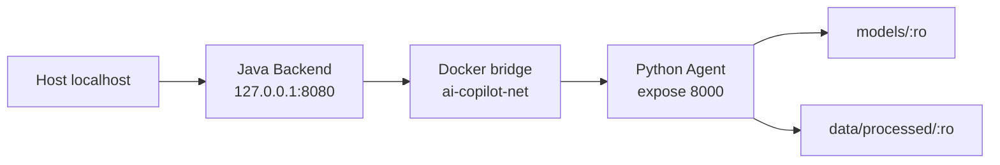

# Deployment

## 验证环境

本次部署验证在腾讯云小规格实例上完成，环境如下：

| 项目 | 配置 |
|------|------|
| 操作系统 | Ubuntu 22.04 |
| Docker | 26.1.3 |
| Docker Compose | v2.27.1 |
| 总内存 | 3.3 GiB |
| 部署前可用内存 | 约 1.2 GiB |
| 根分区 | 40 GiB，约 29 GiB 可用 |
| Swap | 4 GiB（部署时创建） |
| swappiness | 10 |

> 注意：以上为本次验证环境，不是最低官方要求。

## 部署方式

采用**本地构建 + 上传**方式，不在服务器执行重型构建。

### 构建流程

1. 本地构建 Docker 镜像
2. `docker save` 导出为 tar 文件
3. gzip 压缩
4. SHA-256 校验
5. SCP 上传到服务器
6. 服务器 `docker load` 加载镜像

### 镜像

| 镜像 | 说明 |
|------|------|
| enterprise-ai-copilot-python:6e24f52 | Python Direct ONNX 生产镜像 |
| enterprise-ai-copilot-java:6e24f52 | Java Backend 生产镜像 |

## 目录结构

```
/opt/enterprise-ai-copilot/
├── models/
│   └── bge-small-zh-v1.5-onnx/    # ONNX 模型文件（只读挂载）
│       ├── onnx/model.onnx
│       ├── tokenizer.json
│       └── 1_Pooling/config.json
├── data/
│   └── processed/                  # 知识库数据（只读挂载）
│       ├── faiss.index
│       ├── faiss_metadata.json
│       ├── chunks.json
│       └── embeddings.json
├── deploy/
│   ├── docker-compose.prod.yml
│   └── .env                        # 权限 600
├── releases/                       # 发布产物（临时）
└── backups/                        # 配置备份
```

## 模型部署

### 模型信息

- 模型：BAAI/bge-small-zh-v1.5
- 格式：ONNX FP32
- 维度：512
- Runtime：Direct ONNX Runtime（不加载 Torch）
- Provider：CPUExecutionProvider

### 部署要求

- 模型文件不进 Git
- 只读挂载到容器
- 校验 SHA-256 一致性
- 不在服务器在线导出

### SHA-256 校验

```
model.onnx: f2220ab6b0959ee6ecf4c52dc793a77798aefa98f267f5bcce15c497612d4238
```

## Compose 配置

### 服务拓扑



### 资源限制

| 服务 | 内存限制 | 说明 |
|------|----------|------|
| Python | 512 MiB | Uvicorn 单 Worker |
| Java | 512 MiB | JVM -Xms64m -Xmx256m |

### 端口绑定

| 服务 | 端口 | 绑定 |
|------|------|------|
| Python | 8000 | 仅 Docker 内网（expose） |
| Java | 8080 | 127.0.0.1（localhost only） |

### 环境变量

| 变量 | 说明 |
|------|------|
| EMBEDDING_BACKEND | onnx_direct |
| EMBEDDING_MODEL_PATH | /app/models/embedding/bge-small-zh-v1.5-onnx |
| EMBEDDING_ONNX_FILE | onnx/model.onnx |
| EMBEDDING_PROVIDER | CPUExecutionProvider |
| RAG_GATE_MODE | off |
| REWRITE_MODE | none |

## Secret 管理

- `.env` 文件权限 600
- API Key 不进 Git、不进镜像、不出现在 Compose
- 不输出到日志
- 通过 `--env-file` 传入容器

## 健康检查

### 检查命令

```bash
# 容器状态
docker compose -p enterprise-ai-copilot -f /opt/enterprise-ai-copilot/deploy/docker-compose.prod.yml ps

# 资源使用
docker stats --no-stream

# 系统内存
free -h
swapon --show

# Java 健康检查
curl http://127.0.0.1:8080/api/health

# Python 内网检查（通过测试容器）
docker run --rm --network enterprise-ai-copilot_ai-copilot-net \
  curlimages/curl:latest http://python-agent:8000/agent/health
```

### 预期结果

- Python: healthy, `{"service":"agent-python","status":"UP"}`
- Java: healthy, `{"status":"UP","service":"backend-java"}`
- 无 OOM、无重启

## 回滚

仅停止本项目，不影响其他服务：

```bash
docker compose \
  -p enterprise-ai-copilot \
  -f /opt/enterprise-ai-copilot/deploy/docker-compose.prod.yml \
  down
```

不会影响 eat-what 和 jobfit 项目。

## 当前边界

- 尚未接入 Nginx
- 尚未配置域名和 HTTPS
- 未配置高可用
- 未配置集中日志、APM 或自动扩缩容
- 当前是单机隔离部署验证
