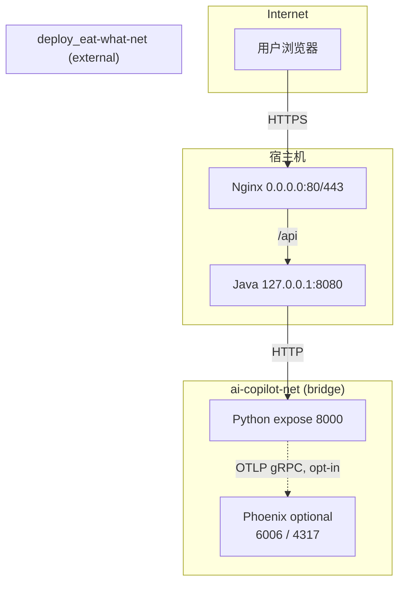
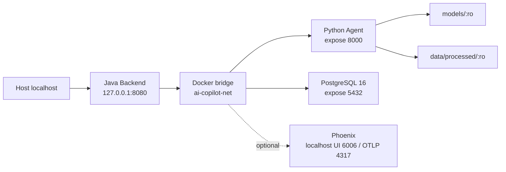

# Deployment

## 验证环境

本次部署验证在腾讯云小规格实例上完成，环境如下：

| 项目 | 配置 |
|------|------|
| 操作系统 | Ubuntu 22.04 |
| Docker | 26.1.3 |
| Docker Compose | v2.27.1 |
| 总内存 | 3.3 GiB |
| 部署前可用内存 | 约 1.2 GiB |
| 根分区 | 40 GiB，约 29 GiB 可用 |
| Swap | 4 GiB（部署时创建） |
| swappiness | 10 |

> 注意：以上为本次验证环境，不是最低官方要求。

## 部署方式

采用**本地构建 + 上传**方式，不在服务器执行重型构建。

### 构建流程

1. 本地构建 Docker 镜像
2. `docker save` 导出为 tar 文件
3. gzip 压缩
4. SHA-256 校验
5. SCP 上传到服务器
6. 服务器 `docker load` 加载镜像

构建 Java 和 Python 镜像时使用相同的版本参数，例如：

```bash
--build-arg APP_VERSION=0.4.1-dev \
--build-arg GIT_COMMIT="$(git rev-parse HEAD)" \
--build-arg BUILD_TIME="$(date -u +%Y-%m-%dT%H:%M:%SZ)"
```

生产发布应传入正式版本号、完整 Commit SHA 和 UTC 构建时间。Java 可通过
`/api/version` 查询，Python 内部可通过 `/agent/version` 查询；两个接口均不返回 Secret。
生产 `.env` 应设置 `JAVA_IMAGE` 和 `PYTHON_IMAGE`，值使用版本号与 Git 短 SHA
组成的不可变标签。

### 镜像

| 镜像 | 说明 |
|------|------|
| enterprise-ai-copilot-python:6e24f52 | Python Direct ONNX 生产镜像 |
| enterprise-ai-copilot-java:6e24f52 | Java Backend 生产镜像 |

## 目录结构

```
/opt/enterprise-ai-copilot/
├── models/
│   └── bge-small-zh-v1.5-onnx/    # ONNX 模型文件（只读挂载）
│       ├── onnx/model.onnx
│       ├── tokenizer.json
│       └── 1_Pooling/config.json
├── data/
│   ├── processed/                  # 知识库数据（只读挂载）
│   │   ├── faiss.index
│   │   ├── faiss_metadata.json
│   │   ├── chunks.json
│   │   └── embeddings.json
│   └── eval/
│       └── reports/                # 评估报告（只读挂载到 Python 容器）
│           ├── retrieval_eval_report.json
│           └── generation_eval_report.json
├── deploy/
│   ├── docker-compose.prod.yml
│   └── .env                        # 权限 600
├── releases/                       # 发布产物（临时）
└── backups/                        # 配置备份
```

## 模型部署

### 模型信息

- 模型：BAAI/bge-small-zh-v1.5
- 格式：ONNX FP32
- 维度：512
- Runtime：Direct ONNX Runtime（不加载 Torch）
- Provider：CPUExecutionProvider

### 部署要求

- 模型文件不进 Git
- 只读挂载到容器
- 校验 SHA-256 一致性
- 不在服务器在线导出

### SHA-256 校验

```
model.onnx: f2220ab6b0959ee6ecf4c52dc793a77798aefa98f267f5bcce15c497612d4238
```

## 代码能力 vs 仓库部署默认 vs 公网实际状态

> 本节是本仓库对当前部署能力的唯一事实口径。**公网实际状态仓库无证据** —— 公网是否启用 Planner-first / 受控业务动作 / 只读企业 Tool，以运维 `.env` 与服务器实际环境变量为准，本文不据此做能力宣称。

| 维度 | main 代码能力（已实装） | 仓库部署默认（`deploy/docker-compose.prod.yml` + `agent-python/.env.example`） | 公网实际状态 |
|------|------------------------|------------------------------------------------------------------------|--------------|
| Python Agent 状态图 | 生产入口固定为 `safety → planner ⇄ tool_executor`（Planner-first）；legacy Router-first 仅测试/离线兼容 | Compose 不再注入图选择开关，服务启动后固定走 Planner-first | 仓库无证据 |
| Planner-first 可见 Tool（按可信状态动态收缩） | `rag_answer_tool` 始终可见；受信任 `employee_id` + `JAVA_BASE_URL` + `JAVA_INTERNAL_TOKEN` 齐全时追加 Java read Tool；Enterprise OA MCP URL + employee 时追加 travel/invoice；`allow_eval=true` 追加 `eval_report_tool`；`allow_business_actions=true` 且有受信任 `employee_id` 时追加 leave/expense proposal；公开 `demo` 由 Java 固定为 `allow_business_actions=false`；模型不能自行扩大 Tool 权限 | Planner-first 默认开启；compose 默认未注入 Java read 与 Enterprise OA MCP 配置，因此对应 Tool 不暴露给 Planner。RAG 不受影响；Java 端的 `allow_eval` / `allow_business_actions` 仍受 Admin/业务开关约束 | 仓库无证据 |
| `leave_balance_tool` / `leave_request_tool`（Python → Java 只读） | 通过 `JavaReadClient` 调 `/api/internal/leave/*`，依赖受信任 `employee_id`、`JAVA_BASE_URL` 与 `JAVA_INTERNAL_TOKEN` | compose **未注入** `JAVA_BASE_URL` / `JAVA_INTERNAL_TOKEN` / `JAVA_TIMEOUT_SECONDS` ⇒ 两个 Tool 不暴露给 Planner；若绕过 Planner 直接调用，下游仍返回 `LEAVE_READ_DISABLED` / `LEAVE_READ_FORBIDDEN` | 仓库无证据 |
| `leave_proposal_tool` | Planner-first 下生成 `action_proposal` / `missing_fields`，**不执行写操作**，且**不依赖** `JAVA_BASE_URL` / `JAVA_INTERNAL_TOKEN` | Planner-first 默认开启 ⇒ 请求具备 `allow_business_actions=true` 与受信任 `employee_id` 时可见；公开 `demo` 永远不可见；即使 Planner-first 启用，仍需 `BUSINESS_ACTIONS_ENABLED=true` 才能让 Java 接收 Proposal 并创建 PendingAction | 仓库无证据 |
| `BusinessActionService` / PendingAction / confirm / cancel | Java 权威控制面：`createPending` 生成 `confirmationNonce`；`/api/agent/actions/{id}/confirm` 与 `/cancel`；owner / nonce / 状态机 / TTL / 幂等 / PostgreSQL 事务 | compose 默认 `BUSINESS_ACTIONS_ENABLED=${:-false}` ⇒ 受控业务动作默认关闭 | 仓库无证据 |
| Admin / Evaluation 权限 | 浏览器使用 Java 已验证 JWT 的 `role=ADMIN`；Java 通过 `X-Allow-Eval` 告知 Python | `ADMIN_TOKEN` 仅保留为业务动作的可选 server-side hardening，compose `:?` 强制非空 | 仓库无证据 |
| LangGraph PostgreSQL 执行快照 | Java 用可信 `userId + conversationId` 计算 `X-Agent-Thread-Id`；Python 启动时固定创建 Pool / `PostgresSaver` / 持久化图，节点以 `sync` 落盘 | Compose 以 `:?` 强制运维显式提供 `LANGGRAPH_CHECKPOINT_DSN`；Python 等待 PostgreSQL health 后启动 | 仓库无证据 |
| Phoenix/OpenTelemetry | Python 两条 AI 路径建立根 Span，OpenInference 自动插桩 OpenAI SDK 与 LangChain/LangGraph；BatchSpanProcessor、采样、默认正文脱敏、fail-open | `PHOENIX_TRACING=false` 且 Phoenix 服务位于可选 `observability` profile，不随默认 Compose 启动 | 仓库无证据 |

**默认安全启动口径**：本仓库的 `deploy/docker-compose.prod.yml` 默认部署固定使用 Planner-first 与 PostgreSQL 执行快照；后者要求运维显式提供 `LANGGRAPH_CHECKPOINT_DSN`，连接、`setup()` 或图编译失败会阻止 Python 启动，绝不退回无快照模式。受控业务动作、只读企业 Tool 与 Scoped Conversation Memory 写入仍默认关闭。对外宣称的“Planner-first + 受控业务动作公网演示”需要服务器 `.env` 显式打开 `BUSINESS_ACTIONS_ENABLED=true`；若演示包含只读企业 Tool，还需额外设置 `JAVA_INTERNAL_TOKEN` 与 `JAVA_BASE_URL`。Memory 真实写入还需显式设置 `MEMORY_WRITE_MODE=ENABLED`，但不依赖 Java URL、内部 Token 或 write scope；Java 在当前认证请求中落库。**且这些事实仓库不掌握**。

### 域名和证书

| 项目 | 说明 |
|------|------|
| 域名 | copilot.jintianchi.cn |
| DNS | A 记录指向服务器 IP |
| 证书 | 独立 Let's Encrypt 证书（非共享） |
| 签发 | Docker certbot/certbot:v5.7.0 |
| 有效期 | 90 天（自动续签） |
| 续签 | `/opt/enterprise-ai-copilot/deploy/renew-copilot-cert.sh` |
| Cron | `/etc/cron.d/eac-copilot-certbot`（每天 3:15 AM 和 3:15 PM） |

### Nginx 配置

配置文件归档在 `deploy/nginx/copilot.conf`，当前服务器因历史原因将该片段合并进共享 `eat-what.conf`。

**HTTP (80)：**
- ACME challenge 路由（webroot）
- 其他请求 301 到 HTTPS

**HTTPS (443)：**
- 独立证书路径
- 静态文件：`/usr/share/nginx/html/copilot/current`
- SPA fallback：`try_files $uri $uri/ /index.html`
- `/assets/` 缓存 7 天
- `/api/` 反向代理到 `http://ai-copilot-java:8080`
- 安全响应头（nosniff, DENY, strict-origin, permissions-policy）
- 请求体限制 64k
- API 限流：2 req/s，burst 5

### 前端 Release 结构

```
/opt/eat-what/deploy/nginx/html/copilot/
├── releases/
│   └── ${RELEASE_ID}/          # 不可变 release 目录
│       ├── index.html
│       └── assets/
└── current -> releases/${RELEASE_ID}  # 原子软链接切换
```

Release ID 格式：`${UTC_TIMESTAMP}-${SHORT_SHA}`

### Docker 网络



- Nginx 位于 `deploy_eat-what-net`（与 eat-what/jobfit 共享）
- Java 同时连接 `deploy_eat-what-net` 和 `ai-copilot-net`
- Python 只连接 `ai-copilot-net`
- Phoenix 只在 `observability` profile 下启动；控制台端口绑定宿主机 localhost，Collector 只供 Docker 内网访问
- Nginx 无法直接访问 Python

### CORS

生产 Origin：`https://copilot.jintianchi.cn`

### 安全措施

- HTTP → HTTPS 301 重定向
- 安全响应头（X-Content-Type-Options, X-Frame-Options, Referrer-Policy, Permissions-Policy）
- API 基础限流（2 req/s，burst 5）
- 应用有界并发：Java/Python 各 3 个并发槽，短队列超时返回 429
- 不开放公网 8000/8080
- 不在服务器构建前端或 Java/Python 镜像

## Compose 配置

### 服务拓扑



### 资源限制

| 服务 | 内存限制 | 说明 |
|------|----------|------|
| Python | 512 MiB | Uvicorn 单 Worker |
| Java | 512 MiB | JVM -Xms64m -Xmx256m |
| PostgreSQL | Compose 管理 | 独立命名 Volume，Flyway 自动迁移 |
| Phoenix | 未设置固定上限 | 可选 profile；SQLite 独立 Volume，启用前需按目标主机压测并设置资源预算 |

### 端口绑定

| 服务 | 端口 | 绑定 |
|------|------|------|
| Python | 8000 | 仅 Docker 内网（expose） |
| Java | 8080 | 127.0.0.1（localhost only） |
| PostgreSQL | 5432 | 仅 Docker 内网（expose，不映射宿主机） |
| Phoenix UI / OTLP HTTP | 6006 | 仅 `127.0.0.1`，不得直接暴露公网 |
| Phoenix OTLP gRPC | 4317 | 仅 Docker 内网（expose） |

### 环境变量

| 变量 | 说明 |
|------|------|
| EMBEDDING_BACKEND | onnx_direct |
| EMBEDDING_MODEL_PATH | /app/models/embedding/bge-small-zh-v1.5-onnx |
| EMBEDDING_ONNX_FILE | onnx/model.onnx |
| EMBEDDING_PROVIDER | CPUExecutionProvider |
| LLM_TIMEOUT | ${LLM_TIMEOUT:-30}（秒） |
| LLM_MAX_OUTPUT_TOKENS | ${LLM_MAX_OUTPUT_TOKENS:-1024} |
| LLM_MAX_RETRIES | ${LLM_MAX_RETRIES:-0} |
| AGENT_REQUEST_TIMEOUT_SECONDS | ${AGENT_REQUEST_TIMEOUT_SECONDS:-40}（秒） |
| AI_MAX_CONCURRENT_REQUESTS | ${AI_MAX_CONCURRENT_REQUESTS:-3} |
| AI_QUEUE_TIMEOUT_MS | ${AI_QUEUE_TIMEOUT_MS:-500} |
| LANGGRAPH_CHECKPOINT_DSN | `:?` 必填；独立于 `SPRING_DATASOURCE_URL`，不得在 compose 内拼接用户名或密码 |
| LANGGRAPH_CHECKPOINT_CONNECT_TIMEOUT_SECONDS | `${LANGGRAPH_CHECKPOINT_CONNECT_TIMEOUT_SECONDS:-3}`；用于 Pool 建连与 wait |
| PYTHON_AGENT_CONNECT_TIMEOUT | ${PYTHON_AGENT_CONNECT_TIMEOUT:-3000}（毫秒） |
| PYTHON_AGENT_READ_TIMEOUT | ${PYTHON_AGENT_READ_TIMEOUT:-50000}（毫秒） |
| PYTHON_AGENT_HTTP_MAX_CONNECTIONS | ${PYTHON_AGENT_HTTP_MAX_CONNECTIONS:-6} |
| PYTHON_AGENT_MAX_CONCURRENT_REQUESTS | ${PYTHON_AGENT_MAX_CONCURRENT_REQUESTS:-3} |
| POSTGRES_DB | PostgreSQL 数据库名 |
| POSTGRES_USER | PostgreSQL 用户名 |
| POSTGRES_PASSWORD | 必填，无默认生产密码 |
| SPRING_DATASOURCE_URL | Java 到 Compose PostgreSQL 的 JDBC 地址 |
| PYTHON_AGENT_ACQUIRE_TIMEOUT_MS | ${PYTHON_AGENT_ACQUIRE_TIMEOUT_MS:-500} |
| ADMIN_TOKEN | ${ADMIN_TOKEN:?ADMIN_TOKEN is required in production}（必填） |
| AUTH_JWT_SECRET | ${AUTH_JWT_SECRET:?AUTH_JWT_SECRET is required in production}（至少 32 字节随机值） |
| AUTH_JWT_ISSUER | ${AUTH_JWT_ISSUER:-enterprise-ai-copilot} |
| AUTH_JWT_AUDIENCE | ${AUTH_JWT_AUDIENCE:-enterprise-ai-copilot} |
| AUTH_JWT_TTL_SECONDS | ${AUTH_JWT_TTL_SECONDS:-3600} |
| DEMO_AUTH_ENABLED | compose 默认 `false`；显式设置 `true` 才初始化五个固定账号 |
| DEMO_PUBLIC_PASSWORD | compose 默认公开值 `demo-public-2026`；仅用于 `demo`（U10000/E10000），可与前端 `VITE_PUBLIC_DEMO_PASSWORD` 一致 |
| DEMO_INTERVIEW_PASSWORD | `DEMO_AUTH_ENABLED=true` 时必填；仅用于 `zhangsan`，server-side only |
| DEMO_ADMIN_PASSWORD | `DEMO_AUTH_ENABLED=true` 时必填；仅用于 `admin`，server-side only |
| DEMO_AUTH_DEFAULT_PASSWORD | `DEMO_AUTH_ENABLED=true` 时必填；仅用于 lisi/wangwu legacy seed，不写入前端 bundle |
| BUSINESS_ACTIONS_ENABLED | compose 默认 `${:-false}`；启用后 Java 才接收 Proposal 并创建 PendingAction |
| BUSINESS_ACTIONS_REQUIRE_ADMIN | compose 默认 `${:-false}`；`true` 时业务动作还要求内部请求提供匹配的 `ADMIN_TOKEN`，浏览器不发送该 Token |
| JAVA_INTERNAL_TOKEN | compose 默认未注入；缺值时只读企业 Tool 不可用 |
| JAVA_BASE_URL | compose 默认未注入；缺值时只读企业 Tool 返回 `LEAVE_READ_DISABLED` |
| JAVA_TIMEOUT_SECONDS | compose 默认未注入；Python 端 `.env.example` 默认 5 |
| MEMORY_WRITE_MODE | compose 默认未注入；Python 默认 `DISABLED`；`AUDIT_ONLY` 仅审计，`ENABLED` 随 Agent 响应返回提案 |
| PHOENIX_TRACING | compose 默认 `${:-false}`；关闭时不加载 Phoenix 插桩组件 |
| PHOENIX_COLLECTOR_ENDPOINT | compose 固定 `http://phoenix:4317`；仅启用 tracing 时使用 |
| PHOENIX_PROJECT_NAME | `${PHOENIX_PROJECT_NAME:-enterprise-ai-copilot}` |
| PHOENIX_SAMPLE_RATE | `${PHOENIX_SAMPLE_RATE:-1.0}`，合法范围 `[0,1]` |
| PHOENIX_CAPTURE_CONTENT | `${PHOENIX_CAPTURE_CONTENT:-false}`；默认隐藏 Prompt、输入和输出正文 |
| PHOENIX_DEFAULT_RETENTION_POLICY_DAYS | `${PHOENIX_DEFAULT_RETENTION_POLICY_DAYS:-7}` |
| MOCK_OA_ENABLED | Java 是否启用 Mock OA 提交与状态查询，默认 false |
| MOCK_OA_IMAGE | 生产 Compose 使用的 Mock OA 镜像；默认 `enterprise-ai-copilot-mock-oa:6e24f52` |
| MOCK_OA_BASE_URL | Java 访问 Mock OA 的基础地址；本地通常为 `http://localhost:8010` |
| MOCK_OA_WEBHOOK_SECRET | Java 与 Mock OA 共享的 HMAC-SHA256 密钥；生产必须通过 Secret 注入 |
| MOCK_OA_WEBHOOK_REPLAY_WINDOW_SECONDS | Java webhook 时间戳窗口，最大 300 秒，默认 300 |
| MOCK_OA_WEBHOOK_URL | Mock OA 回调 Java 的完整 URL；本地 Compose 默认使用 `host.docker.internal:8080` |
| MOCK_OA_WEBHOOK_TIMEOUT_SECONDS | Mock OA 回调超时，默认 5 秒，最大 30 秒 |
| EXTERNAL_APPROVAL_RETRY_DELAY_MS | 外部提交失败后的重试延迟，默认 30000 ms |
| EXTERNAL_APPROVAL_RETRY_BATCH_SIZE | 每轮外部提交重试候选上限，默认 20，代码限制为 1–100 |
| EXTERNAL_APPROVAL_RECONCILIATION_INTERVAL_MS | reconciliation 间隔与单 claim 再检查窗口，默认 60000 ms |
| EXTERNAL_APPROVAL_RECONCILIATION_BATCH_SIZE | 每轮 reconciliation 候选上限，默认 20，代码限制为 1–100 |
| EXTERNAL_APPROVAL_RESUME_RETRY_INTERVAL_MS | external resume 即时失败后的重试间隔，默认 60000 ms |
| EXTERNAL_APPROVAL_RESUME_BATCH_SIZE | 每轮 external resume 候选上限，默认 20，代码限制为 1–100 |

生产 Compose 的 Mock OA 服务只在 `ai-copilot-net` 内以 `expose: 8010` 提供服务，不配置宿主机 `ports`；Java 使用 `http://mock-oa:8010` 访问。生产环境要求通过 Secret 注入 `MOCK_OA_WEBHOOK_SECRET`，而 `MOCK_OA_ENABLED` 仍默认关闭。Local Compose 保留 `127.0.0.1:8010:8010`，仅用于本地测试和调试。

PostgreSQL 是 Java 受控业务动作与 Python 执行快照的生产强依赖：Java 和 Python 都等待数据库健康后启动。Java 只通过 Flyway 管理业务表；Python Checkpoint Runtime 只调用 LangGraph 官方 `PostgresSaver.setup()` 创建和升级其 checkpoint 表，绝不写 Java Flyway 或自定义 checkpoint SQL。`LANGGRAPH_CHECKPOINT_DSN` 与 `SPRING_DATASOURCE_URL` 独立配置，开发/CI 可以暂用同一数据库，生产可分离数据库与权限。执行快照不是业务查询源；报销、请假、PendingAction 仍只查询 Java 业务系统。LeaveRequest 编号来自 PostgreSQL Sequence，事务回滚可能产生安全的编号间隙。

本地或受控登录演示需设置 `DEMO_AUTH_ENABLED=true`、`DEMO_PUBLIC_PASSWORD`、`DEMO_INTERVIEW_PASSWORD`、`DEMO_ADMIN_PASSWORD`、`DEMO_AUTH_DEFAULT_PASSWORD` 与 `BUSINESS_ACTIONS_ENABLED=true`。其中 public password 是刻意公开的体验凭据，其他三个密码只存在服务端配置；Java 服务端按可信身份计算 `allow_business_actions`，`demo` 永远为 `false`，正常员工按既有员工权限允许；`BUSINESS_ACTIONS_REQUIRE_ADMIN` 默认 `false`，只有显式设为 `true` 才额外要求 server-only `ADMIN_TOKEN`，浏览器不发送该 Token。前端只允许通过 `frontend/.env.example` 注入公开 demo 凭据，`VITE_*` 会进入浏览器 bundle。Mock OA 使用独立 SQLite：终态先提交再 best-effort 回调 Java，Java 通过 HMAC webhook 接收通知并 GET OA 权威状态；回调失败不回滚 OA。Java 侧的 reconciliation worker 始终低频、限批，先提交 `external_last_checked_at` CAS，再执行 HTTP，不把 HTTP 放进本地事务；provider 关闭或 OA 失败时保持 `WAITING_APPROVAL` 并在窗口后重试。Java ExpenseClaim 终态提交后，以持久化 correlation 重建原 Agent runtime，使用 false capabilities 调用 Python external resume；Java → Python HTTP 不在数据库事务内，失败保留终态并由 worker 重试。当前 thread guard 为单实例进程内实现；event inbox/outbox 和分布式协调不在当前范围。

Planner-first 下，RAG 不依赖 Java read 配置；`leave_proposal_tool` 可见性取决于 `allow_business_actions` 与受信任 `employee_id`，并由 `BUSINESS_ACTIONS_ENABLED=true` 支持 Java 创建 PendingAction。只读企业 Tool 额外需要 `JAVA_BASE_URL` 与 `JAVA_INTERNAL_TOKEN` 才会暴露给 Planner；两者缺失时，下游直接调用仍按稳定错误码 `LEAVE_READ_DISABLED` / `LEAVE_READ_FORBIDDEN` 拒绝，不会伪造成功。Scoped Conversation Memory 默认 `MEMORY_WRITE_MODE=DISABLED`，不会调用 Extractor；启用后由 Java 当前认证请求持久化响应内提案。

### 按需启动 Phoenix

Phoenix 不属于默认生产依赖。启用时同时打开 Compose profile 与 Python tracing：

```bash
PHOENIX_TRACING=true docker compose \
  --profile observability \
  -p enterprise-ai-copilot \
  -f /opt/enterprise-ai-copilot/deploy/docker-compose.prod.yml \
  up -d
```

控制台默认位于服务器 `127.0.0.1:6006`，远程管理应使用 SSH Tunnel，
不要把端口直接暴露公网。Collector 不可用时 BatchSpanProcessor 可丢弃 Trace，
但 Python 业务响应、离线评估和 Java 权威业务链路必须继续工作。

## Secret 管理

- `.env` 文件权限 600
- API Key 不进 Git、不进镜像、不出现在 Compose
- ADMIN_TOKEN 如保留，必须是非空随机值，仅存于服务器 `.env`；不进入 VITE、浏览器 bundle 或浏览器请求
- 不输出到日志
- 通过 `--env-file` 传入容器

## 健康检查

### 检查命令

```bash
# 容器状态
docker compose -p enterprise-ai-copilot -f /opt/enterprise-ai-copilot/deploy/docker-compose.prod.yml ps

# 资源使用
docker stats --no-stream

# 系统内存
free -h
swapon --show

# Java 健康检查
curl http://127.0.0.1:8080/api/health

# Python 内网检查（通过测试容器）
docker run --rm --network enterprise-ai-copilot_ai-copilot-net \
  curlimages/curl:latest http://python-agent:8000/agent/health
```

### 预期结果

- Python: healthy，响应包含 `status=UP` 和 `concurrency` 快照
- Java: healthy，响应包含 `status=UP` 和 `concurrency` 快照
- 无 OOM、无重启

## 回滚

仅停止本项目，不影响其他服务：

```bash
docker compose \
  -p enterprise-ai-copilot \
  -f /opt/enterprise-ai-copilot/deploy/docker-compose.prod.yml \
  down
```

不会影响 eat-what 和 jobfit 项目。

## 当前边界

- 已接入 Nginx 反向代理（copilot.jintianchi.cn）
- 已配置独立域名和 HTTPS（Let's Encrypt 自动续签）
- 未配置高可用
- 未配置集中日志、APM 或自动扩缩容
- 当前是单机隔离部署验证 + 公网演示
- 公网演示不等于生产负载验证
- 已实现单机有界并发保护，但没有高可用、自动扩缩容或大规模容量结论

分层压测步骤、停止条件和验收口径见 [`concurrency-and-load-test.md`](concurrency-and-load-test.md)。
