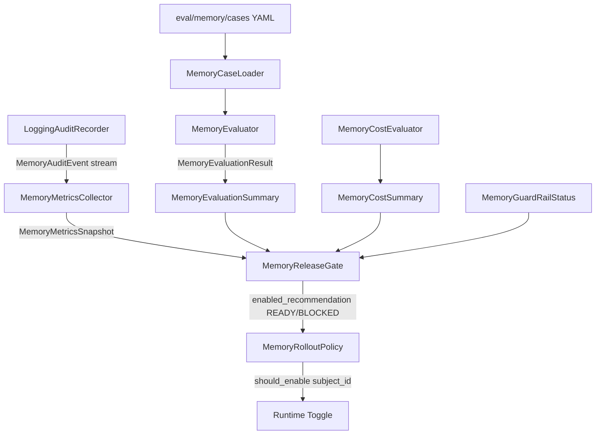

# Scoped Conversation Memory P0 架构说明

本文件是 Scoped Conversation Memory P0 的最终架构基线（Phase 6 Freeze）。
它不引入新能力，只把 Read / Write / Control / Security / Failure 五条边界
在文档层固定下来，作为后续 Phase 的回归锚点。

与 `docs/architecture.md` 的关系：后者描述企业级 RAG + Agent 整体架构；
本文件只覆盖 Memory 子系统的运行链路与信任边界。

> **归档状态（本文档更新时点）**：Control Path（C 节）描述的
> `MemoryMetricsCollector` / `MemoryEvaluator` / `MemoryReleaseEvaluator` /
> `MemoryRolloutPolicy` 及其关联的 `eval/memory/` 离线评估组件已整体归档至
> `archive/memory-v1/`，不在当前运行时导入路径。A / B / D / E 节描述的
> Read Path 与 Write Path 为当前活跃实现；运行时实际调用链路以
> `docs/memory-runtime-v1-architecture.md` 为准（该文档逐条对应当前代码）。

---

## A. Read Path

目的：在每个 Agent 请求的入口，把"上一轮 ACTIVE 任务记忆"注入 Planner
只读上下文，使 Planner 能在不修改任何业务授权的前提下恢复任务。

```mermaid
flowchart LR
    UI[Frontend] -->|HTTPS| JC[Java Controller]
    JC -->|trusted VerifiedIdentity| IIC[Internal Agent Chat]
    IIC -->|HTTP /agent/langgraph/chat| PY[Python FastAPI]
    PY -->|trusted userId, conversationId, scope| MRH[MemoryRuntimeHook.read]
    MRH -->|read_conversation_memory| JMC[JavaMemoryClient]
    JMC -->|/api/internal/memory/conversations/{id}/active| JSE[Java Memory Endpoint]
    JSE -->|trusted userId + conversationId| REPO[(ai_task_memory)]
    REPO -->|ACTIVE row| JSE
    JSE -->|memoryDto| JMC
    JMC -->|memoryContext dict| MRH
    MRH -->|inbound state.memory_context| PL[Planner]
    PL -->|tool_history context| TE[Tool Executor]
```

关键不变量：

1. `userId` 永远来自 Java `VerifiedIdentity`，Python 不接收、也不允许重新构造；
2. `conversationId` 来自 Java 内部请求 envelope，Python 仅作为 namespace 透传；
3. Read Path 只读取 `status = ACTIVE` 的记录，`COMPLETED` / `ABANDONED`
   不被读回 Planner；
4. `memoryContext` 是**只读、不被 Planner 信任**的历史数据：
   - 不参与 Tool 决策；
   - 不进入 Tool arguments；
   - 不被改写后写回。

实现入口：

- Python: `app/memory/memory_runtime_hook.py` (`_read_memory`)
- Java:  `AiTaskMemoryService.findActive(...)` + Internal Endpoint
  `POST /api/internal/memory/conversations/{conversationId}/active`

---

## B. Write Path

目的：Agent 响应出口旁路做"是否值得跨请求保存"的判断；通过后再
把结构化 `MemoryProposal` 落到 Java 持久层。

```mermaid
flowchart TD
    AR[Agent Result] -->|tool_history, observation, existing_memory| EI[MemoryExtractionInput]
    EI --> MTP[MemoryTriggerPolicy]
    MTP -->|should_extract=True| EXT[MemoryExtractor]
    EXT -->|llm_service.call_llm| MPA[MemoryProposal]
    MPA --> MWP[MemoryWritePolicy]
    MWP -->|trusted key strip + size guard| MWC[MemoryWriteCommand]
    MWC --> MQP[MemoryQuotaPolicy]
    MQP -->|state-machine whitelist| WMD[MemoryWriteMode]
    WMD -->|ENABLED| MWD[MemoryWriteDispatcher]
    WMD -->|DISABLED| DROP[drop silently + audit]
    MWD --> JMC[JavaMemoryClient]
    JMC -->|/api/internal/memory/conversations/{id}/write| JSE[Java Memory Endpoint]
    JSE -->|scope-bound userId| SVC[AiTaskMemoryService]
    SVC --> REPO[(ai_task_memory)]
    JMC -->|ok / error| AUD[MemoryAuditEvent]
    AUD --> REC[MemoryAuditRecorder]
```

关键不变量：

1. `MemoryTriggerPolicy` 是 Pipeline 入口开关；
   - 仅当 `leave_proposal_tool` 成功 / 已有 ACTIVE memory / 明确延续信号
     时才进入 Extractor；
2. `MemoryExtractor` 只接收白名单字段（`question / answer / tool_history /
   observation / existing_memory / action_proposal`），trusted 字段被
   `MemoryExtractionInput.extra='forbid'` 兜底；
3. `MemoryWritePolicy` 是 trusted 字段清洗 + 大小限制的最终边界：
   - `task_state` 内递归剥离 forbidden 键；
   - 字符串值命中敏感关键字 → 替换为 `[REDACTED]`；
   - `task_state` 序列化 ≤ 16 KiB；`summary` ≤ 500 chars；
4. `MemoryQuotaPolicy` 状态机白名单（见 Phase 5E）：
   - `(None, UPSERT)` / `(ACTIVE, UPSERT)` / `(COMPLETED, COMPLETE)` /
     `(ABANDONED, ABANDON)` 才允许；
5. `MemoryWriteMode` 控制 ENABLED / DISABLED：
   - DISABLED 时 Dispatcher 被跳过、仍记录 audit event（写路径不丢信号）；
6. Java 写入只信任 scope 内的 `userId`：
   - `X-Memory-Write-Scope` 由 Java 内部签发，TTL 短；
   - path 上的 `conversationId` 与 scope 绑定，Java 侧双重校验。

实现入口：

- Python: `app/memory/memory_pipeline.py` + `app/memory/memory_write_dispatcher.py`
- Java:   `AiTaskMemoryService.upsert / complete / abandon`（`PendingAction`
  体系外独立的状态机）

---

## C. Control Path

> **已归档**：本节描述的 Metrics / Release Gate / Rollout 组件已归档至
> `archive/memory-v1/`（见文件头归档状态说明）。本节保留为 Phase 6 冻结基线，
> 当前运行时没有 Control Path 组件被调用；若后续重新接入，必须独立设计
> 并补 Runtime / rollout tests。

目的：把 Memory 的"运行时观察"聚合成可判定信号，
让"是否允许生产启用 Memory"这件事有可重复、可审计的答案。



各环节角色：

| 组件 | 输入 | 输出 | 是否 Runtime |
| --- | --- | --- | --- |
| `MemoryMetricsCollector` | `MemoryAuditEvent` | `MemoryMetricsSnapshot` | 旁路聚合 |
| `MemoryEvaluator` + `MemoryCaseLoader` | YAML case + observation | `MemoryEvaluationResult` | **离线** |
| `MemoryCostEvaluator` | `MemoryCostSample` | `MemoryCostResult` | **离线** |
| `MemoryReleaseEvaluator` | snapshot + summary ×3 + guard_rail | `MemoryReleaseAuditResult` | **离线** |
| `MemoryRolloutPolicy` | `subject_id` | `bool` | Runtime 旁路 |

Release Gate 判定准则（fail-closed）：

- 全部五项 pass ⇒ `enabled_recommendation = "READY"`
- 任一不通过 ⇒ `"BLOCKED"`，并按 `safety → rollout → isolation →
  evaluation → cost` 固定顺序写出 `blockers` 列表。

阈值（可由 `ReleaseThresholds` 覆盖）：

- `min_mean_score = 0.8`
- `max_mean_overhead_ms = 500.0`
- `positive_roi_total > 0`（允许部分样本 ROI ≤ 0）

---

## D. Security Boundary

| 字段 | 来源 | 写入路径 | 读取路径 |
| --- | --- | --- | --- |
| `user_id` | Java `VerifiedIdentity`（已认证会话） | 由 Java scope 注入；Python 不参与构造 | Java scope 校验后再读取 |
| `conversation_id` | Java 内部 envelope | Java 侧 path 与 scope 绑定校验 | 仅作 namespace，不参与权限 |
| `employee_id` | Java 受控注入 | 与 `user_id` 同作用域 | 同上 |
| `business_date` / `role` / `permission` / `allow_eval` / `allow_business_actions` | Java 受控注入 | 不进入 `MemoryProposal` | 不注入 Planner |
| `summary` / `task_state` | 业务上下文（脱敏后） | 由 `MemoryWritePolicy` 过滤 | 仅作为历史数据 |

**trusted 字段过滤（Write Path 双重防御）**：

1. Schema 层：`MemoryProposal.extra='forbid'` —— 未声明字段直接 `ValidationError`；
2. Policy 层：`MemoryWritePolicy.sanitize_task_state` 递归剥离
   `user_id / employee_id / conversation_id / role / permission / allow_eval /
   allow_business_actions / business_date / token / jwt / nonce /
   idempotency_key` 等；
3. Java 侧：`AiTaskMemoryService` 重新校验 scope，不依赖 Python 过滤结果。

**task_state 隔离**：

- 不同 `user_id` 的 task_state 由 Java 复合 key
  `(user_id, conversation_id)` 物理隔离；
- Python 永远不接收跨用户 / 跨 conversation 的 task_state；
- Read Path 命中时 `status != ACTIVE` 一律丢弃。

**scope token**：

- `X-Memory-Write-Scope` 由 Java 内部签发（短时）；
- 仅 Java Memory Endpoint 接受；Python `JavaMemoryClient` 只持有 token 但
  不理解其内容（不解析 claim、不复用）；
- Token 与 path 绑定的 `conversationId` 强校验；不匹配返回 403，Python 侧
  视为 `DispatcherError` 记入 audit。

---

## E. Failure Boundary

| 错误 | 位置 | 行为 | 是否 Block Release |
| --- | --- | --- | --- |
| Safety 启发式命中 | `safety_node` | 拒绝执行；audit 记 `safe=False` | 否（仅记日志） |
| TriggerPolicy 不通过 | `memory_pipeline` | 跳过 Extractor / Dispatcher | 否 |
| Extractor 解析失败 | `memory_extractor` | 跳过 Write；audit `error_type` 记录 | 否（不阻断 Agent） |
| `MemoryWritePolicy` 拒绝（trusted 字段 / 大小） | `memory_pipeline` | 跳过 Dispatcher；audit 记录 | 否（fail-safe） |
| `MemoryQuotaPolicy` 拒绝 | `memory_pipeline` | 跳过 Dispatcher | 否 |
| `MemoryWriteMode=DISABLED` | `memory_pipeline` | 跳过 Dispatcher；audit 仍写 | 否 |
| `JavaMemoryClient` HTTP 错误 | `memory_write_dispatcher` | audit `error_type=DispatcherError` | **是**（`write_failure_total > 0`） |
| Java 写入返回 5xx | Java `AiTaskMemoryService` | Python 视作失败 | **是** |
| Java 写入 scope 校验失败 | Java Memory Endpoint | Python 视作失败 | **是** |
| `MemoryAuditRecorder` 抛错 | `memory_runtime_hook` | 仅记日志，绝不冒泡 | 否 |
| `MemoryMetricsCollector` 异常 | 旁路 | 不影响 Runtime | 否 |
| Read Path Java 调用失败 | `memory_runtime_hook` | `memoryContext=None`，Planner 走无记忆路径 | 否 |
| Read Path 返回 403 / scope mismatch | Java Memory Endpoint | 同上，audit 记录 | 否 |
| YAML case 加载失败 | `eval/memory` | 测试失败（eval only） | 是（CI 阻断） |
| Release Gate `BLOCKED` | `MemoryReleaseEvaluator` | **不自动**修改 Rollout | 是（运维决策） |

**核心原则**：

- 所有 Runtime 错误 **fail-safe**（不阻断 Agent 主响应）；
- 所有"成功信号缺失"或"持续失败" **block release**（Release Gate fail-closed）；
- audit / metrics / evaluation 三层错误**永不**反向影响 Runtime。

---

## F. 模块依赖边界（冻结基线）

`app/memory/` 内所有模块在 import 时**禁止**直接依赖：

- `langgraph.*` / `langchain.*`（除 `langchain_core` 的 BaseMessage 等纯类型）
- `app.agents.*`（特别是 `planner_node` / `langgraph_agent`）
- `app.controllers` / `app.routers` / `app.api` / `app.main`
- 数据库驱动（`sqlalchemy` / `asyncpg` / `psycopg`）
- HTTP 客户端（`httpx` / `aiohttp` / `requests`）

允许依赖：

- `pydantic`
- `app.schemas.memory_schema` / `app.schemas.planner_schema`（仅 schema 常量）
- 同包内 `app.memory.*` 模块
- Python 标准库 + 已有项目依赖（`logging`, `hashlib` 等）

本基线由 `tests/test_memory_dependency_boundary.py` 守护。

---

## G. P0 Freeze 验收清单

- [x] Read Path 信任边界明确（Java identity → ACTIVE → memoryContext）
- [x] Write Path 状态机白名单 + 沙箱 + 大小限制
- [x] Control Path 五维 gate 全部覆盖
- [x] Security Boundary 三重防御（schema / policy / Java scope）
- [x] Failure Boundary fail-safe vs fail-closed 边界清晰
- [x] 模块依赖审计通过（无 LangGraph / Planner / HTTP / DB 依赖）
- [x] Release Gate READY 判定可重复（确定性 + 纯函数）
- [x] 不修改 LangGraph / PlannerDecision / AgentState / Java Endpoint / Frontend

冻结日期：Phase 6 验收完成日。
